# 前言

这是一次全新的尝试，由于现阶段科目繁多，笔记、心得、思考写的太过于分散，书上有、ipad上有、电脑上也有，不利于回顾复习，所以我决定在电脑上弄一个文档，专门记录这两周的所有笔记。

另外也算是一个日记吧，记录一下自己现阶段的一些思考和观点，日后也是一个难忘的回忆。

另外这样记录的缺点就是很杂乱，各种各样的东西都在上面，所以最好是每个月有一个总结，一部分优秀的内容，可以重新开一篇文章写，更具备系统性。

# 缓考

## 计算机组成原理缓考复习

1.计算机模型：
cpu的组成，冯诺依曼和哈弗结构的特点

CPU:

控制器：控制控制，就是发号施令，控制各个部件有序的工作，具体讲就是：从内存中取出解题步骤加以分析，然后执行某种操作

运算器（ALU、通用寄存器、数据缓冲寄存器、状态条件寄存器）：其实就是进行加减乘除运算的东西，还可以逻辑运算

cache

指令和数据放在同一个存储器里：冯诺依曼结构
指令和数据分别放在两个存储器里：哈弗结构

2.编码和ALU计算基本问题：
进制转换，ALU能够实现的运算，整数补码的表示范围，浮点数运算的溢出，使用不同的方法表示10进制数据;
32位IEEE754的编码规则，真值计算;

浮点数编码和乘法运算。

- 进制转换：这个不难
  - 2-10
  - 10-2
  - 2-16
- ALU（Arithmetic&logical Unit算术逻辑单元）


3.存储器的问题：
双端口DRAM储存器速度快的原因？
储存器设计，容量扩展，地址线和数据线的位数，地址线和数据线的分配，芯片的片数，芯片的组织，

[计算机组成中位、字节、字、字长、存储单元、存储字、存储字长的辨析](https://blog.csdn.net/qq_44184450/article/details/105850173)

4.总线，接口基本问题：
地址总线的功能；
几种不同的数据传送模式特点，


5.指令和指令编码的问题：
指令操作数的基本寻址方式；
指令周期的第一个cpu周期和第2个cpu 周期的功能，访问主存的区别；
根据给定的指令编码格式，分析基本问题：表示不少条不同的指令？求有效地址EA，保存操作数主存的容量？


指令：操作码+地址码

操作码op：干什么事情，是加减乘除，还是存取

地址码A：运算数据是哪里来的，或是运算结果应该存取哪里

- 寻址方式

1. 立即寻址 MOV AL ,#5

2. 直接寻址 MOV AX, [1000H]

   - 指令的地址码给出操作数所在的存储单元地址 A=EA

   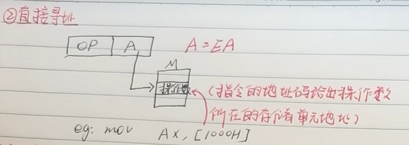

3. 间接寻址 

   - **A为操作数地址**（EA)的地址

4. 寄存器寻址

   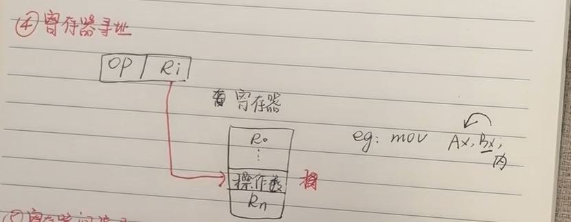

5. 寄存器间接寻址 

   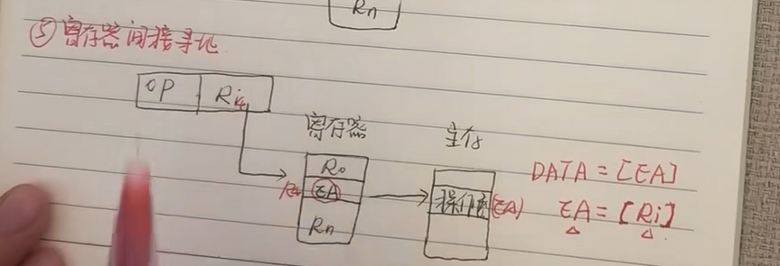

6. 变址寻址

   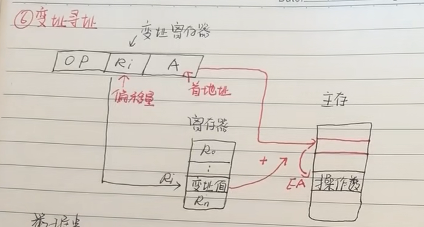

7. 基址寻址

   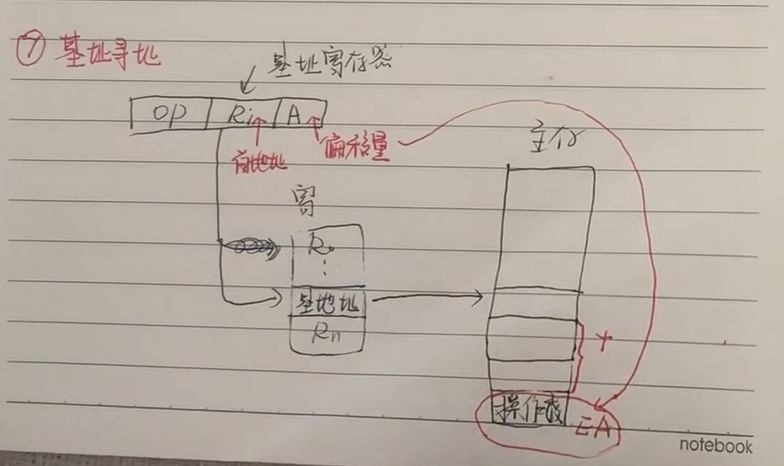

   适用于多用户

8. 相对寻址 

6.cpu和微指令的问题：
机器指令与微指令的关系；
cpu流水线中的相关问题，cpu的基本功能；
微指令编码，判别测试的方法，控存容量的大小，分析微程序流程图，发现指令要实现的功能。

7.信息交换与接口的问题：

几种不同的IO方式特点；

​	单总线结构：一条单一的数据总线来连接cpu、主存和IO设备

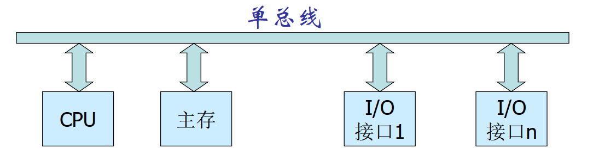

​	双总线：在cpu和I/O 主存之间采用多条主线

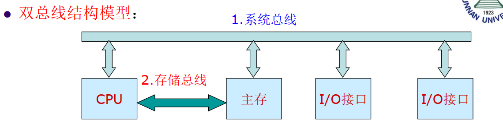

中断的基本概念和过程，

​	程序中断

​	简单中断


知识点

1. 中央处理器CPU

   主要寄存器

   - DR数据缓冲寄存器
   - IR指令寄存器
   - PC程序计数器
   - AR数据地址寄存器
   - 通用寄存器
   - PSW状态字寄存器

   指令周期

   - MOV指令
     1. RR型指令，两个CPU周期
   - LAD指令
   - ADD指令
     1. RR型指令，两个周期

   方框图表示指令周期

   微程序控制器

   1. 控制存储器：只读ROM，一般不能变动，存着各种要实现的伪指令
   2. 微指令寄存器
   3. 地址转移逻辑

   机器指令和微指令的关系：一条机器指令对应一个微程序

   流水CPU


## 数据结构缓考复习

1. 顺序表

   常用操作

   插入：把后面的元素后移，给新元素腾出位置

   删除：找到目标元素，把后面的元素整体向前移动1个位置

   

   

2. 链表

   基本操作

   插入：

   1、把**新插入的结点** 的next指针  指向  **插入位置的后置结点**

   2、将 **插入位置前置结点**的next指针指向 **新插入的结点**

   删除：

   1、将结点从链表中摘下来

   2、释放空间

   

3. 栈

   先进后出

   顺序栈：

   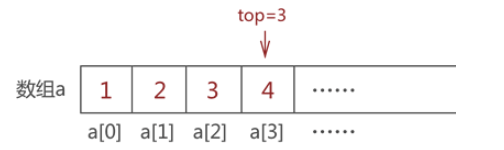

   -  入栈：
     - top=-1,入了第一个元素后top=0,元素被存a[0]中

   链栈

   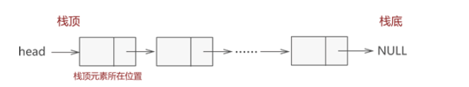

   ```
   head->NULL
   head->1->NULL
   head->1->2->NULL
   head->1->2->3->NULL
   head->1->2->3->4->NULL
   ```

   

4. 队列

   先进先出

   rear(后方的)

   top

   入队的时候rear向左移动

   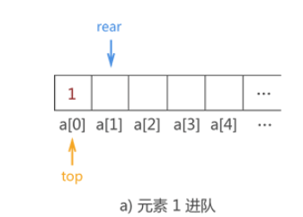

   出队的时候top向右移动

   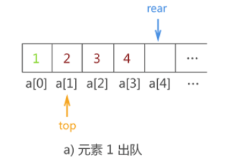

5. 串

   由0个或者多个字符串组成的有限序列

6. 树

   1. 结点：每一个用树这种数据结构存储的元素。被称为一个结点
   2. 叶子结点：终端结点
   3. 结点的度：对一个结点来说，拥有的子树的数量，成为结点的度
   4. 结点的层次：从根开始，树根为第1层，数到最下面，有几层深度就是多少
   5. 子树
   6. 空树
   7. 二叉树：每个结点的度不能超过2，只能是0、1、2
   8. 满二叉树：每个结点的度都是2
   9. 完全二叉树：左边排完，才排右边

7. 图

8. 时间复杂度


## 离散数学缓考复习


# 课程

## 软件工程概论

2022年4月4日16:28:12

顺序图（需求）：参与者和系统的**消息交互**

活动图（需求）：系统动作描述，从头到尾走一遍


case study：学习（copy code）和模仿，之后作出创新，不一样的东西

如果没有例子呢？那就要estimation，评估。


并发：实际上只是在做一件事情，但是由于CPU切换的太快，以至于感觉到在做很多事情

并行：应该是多核心的处理器，就具备了同时处理多个任务的能力，这些任务彼此不会相互干扰

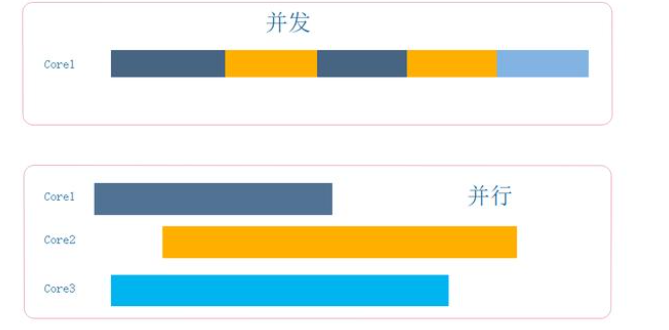


传统过程模型：

1. 开发模型(从无到有)：瀑布、V、喷泉、增量

   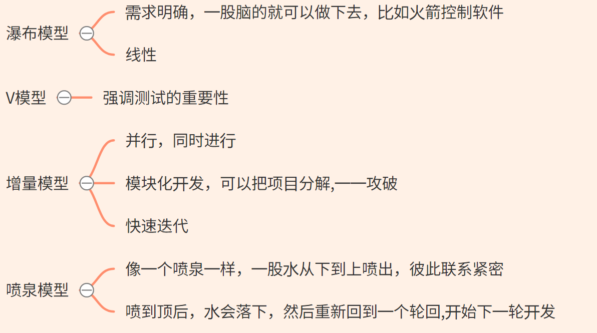

2. 演化模型：(东西已经有了，不断更新换代和优化)

   原型

   并发(concurrent)：强调变更，change，需求经常变更

   螺旋(the spiral):一圈一圈慢慢变大


敏捷模型：

1. srum：增量、迭代

   1. 透明——任务看板

      - 领歌
        - 用户故事user story
        - 产品backlog
        - devops
        - 燃尽图

   2. 检验

      找问题、优化

   3. 适应

2. xp

   xp设计

   - kiss法则
   - CRC card(class-responsibility-)
   - spike solutions:攻克难题
   - refactoring:重构，1.0——>2.0

   xp coding

   - pair programming :绝对编程
   - test
   - customer join顾客的参与挺多

   AOSD：面向方面(切面)的软件开发

   Unified Process(UP):统一过程模型,厚重？

3. 软件过程评估process assessment and improvement


[scrum leangoo](https://www.leangoo.com/) 

[什么是Scrum](https://www.scrumcn.com/agile/scrum-knowledge-library/什么是scrum.html)

[如何实施 SCRUM ？](https://www.zhihu.com/question/19638322/answer/759271217)


[软件架构](http://www.ruanyifeng.com/blog/2016/09/software-architecture.html)

- 分层架构，最常见的
- 事件驱动架构
- 微核架构
- 微服务架构


## 计算机网络

2022年4月5日09:02:49

电子邮件的三个主要组成：

user agents （ua）浏览器之类的

mail servers 

1. mailbox
2. messenge queue

simple mail transfer protocol: SMTP

1. 基于TCP
2. 对方的邮件服务器默认端口号是25（80:http服务器，35dns）FTP：21,20
3. 直接传输
4. 必须是7位ASCII

Mail access protocols接收协议

pop

IMAP

http

2022年4月12日08:30:08周二

peer to peer 点对点，端对端p2p

proxy server代理服务

clients客户机

may be intermittently connected可以间歇的连接

1. 进程通讯

   1. 发起通讯：客户
   2. 等待服务：服务器

2. socket

   1. 由操作系统负责，进程比作一个房子，那么套接字就是它的门

3. 进程寻址

   1. IP：唯一的表示想要连接的那一台主机
   2. 端口号：18bit，6万个左右

4. 应用层协议

   1. 交换的报文类型types of messages exchanged
   2. 各种报文类型的语法message syntax
   3. 字段的语义message semantics 
   4. 一个进程何时发送报文，对报文进行响应rules

5. TCP还是UDP(比如DNS就是基于udp)？

   1. 可靠与速度的选择

6. mail system have three components（邮件系统的组成）:

   1. user agent(用户代理)
   2. mail server(邮件服务器)
   3. Simple Transfer Protocol-SMTP(简单邮件传输协议)

7. DNS提供的服务

   1. host aliasing主机别名
   2. mail server aliasing
   3. load distribution

   

   ### [端口](https://www.iana.org/assignments/service-names-port-numbers/service-names-port-numbers.xhtml?&page=3)

   

   

   

### 第三章 传输层transport layer

1. 网络层和传输层的关系

   1. 网络层：提供主机之间的逻辑通讯
   2. 运输层：为运行在不同主机上的进程之间提供逻辑通讯

2. 多路复用和多路分解

3. [UDP(use datagram protocol)](https://www.rfc-editor.org/rfc/rfc768)报文段结构

   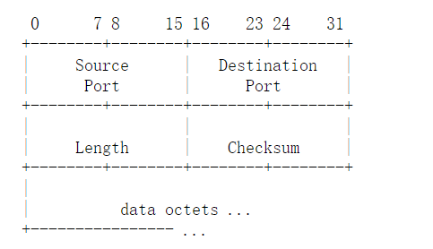

   头部：8bit

   

4. UDP校验和（Checksum)

   1. 定义

      等于和的反码，溢出了要回卷哦。

      只能知道有没有错，并且提出警告，无法判断错误出在哪，而且就算检测出来没问题也可能还是有错误

   2. 为什么选择UDP:速度快

      

      

      

   

   ​	


## 数据库

2022年4月5日14:00:51

cardinality基数（关系）

**:star:一对一：**一个学生选一个数据库老师上，max-card（E,R）=1

外键加在哪里都可以

强制参与：最好就是将两个实体对应的两个表合并，这种就不用外键了

选择参与：任何一方加外键

**:star:一对多**：max-card（E,R）=N

多方加外键

**:star:多对多:**max-card（E,R）=N，max-card（R,E）=N

单独转换为一个关系表

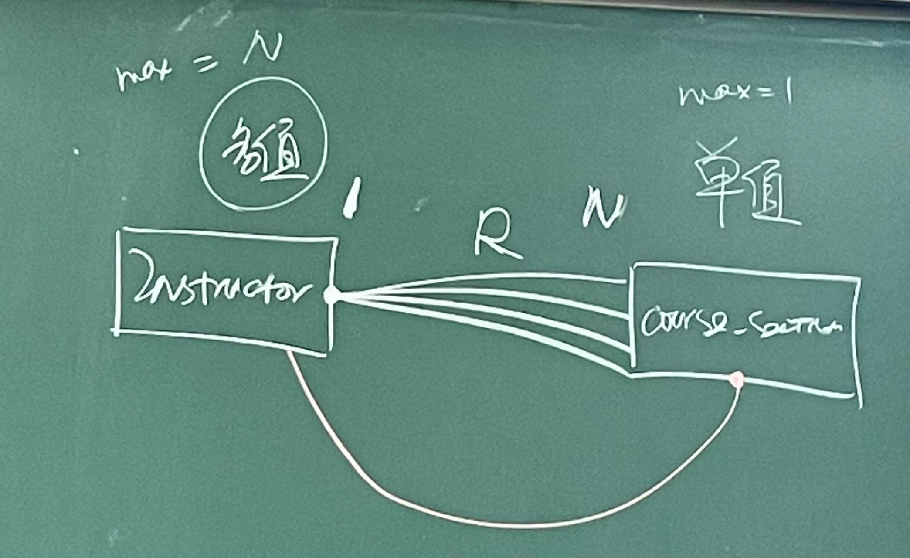

:star:最多连了几个？---max-card---决定关系基数  

:star:最少又连了几个？---min-card---决定是可选参与还是强制参与（1）


一般来讲：cad(E,R)=(X,Y) ，X是max ，Y是min


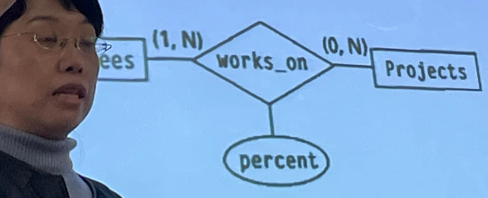

一个员工干多个项目，一个项目也可以由多个员工来做

---所以在员工表里如果有项目这一列，那么就会重复写好多行，产生冗余了就，哪边加外键都不行，重新弄一个表要

员工必须做一个项目，项目可能才开始还没有员工


鸭爪表示多方，一个圈表达0，|表示1


一个比赛，多个球员，一个球员可以参加多个比赛

一个比赛至少一个球员，一个球员可以参加0个比赛


- N元关系

转换为2元关系


规范化-画一个正确的图


## 操作系统

虚拟内存


## C++

1. 两种二义性问题
   1. 直接二义性
   2. 间接二义性


---


# 杂谈


## 垄断

这个星期学校把万言超市和蜜雪冰城等第三方店铺关门了，由于又不准点外卖，所以学生的每一分钱都将流入学校后勤集团的腰包中，这是一件细思极恐的事情，吃饭、喝水、超市购物、洗澡，一个学生的所有支出，都离不开后勤集团

## 记录

我的记性一般，很多东西学了之后就会忘记，比如我现在还记不得typora的很多操作，都是用到了之后再去翻以前写下的记录，不然的话就只能去重新百度，挺浪费时间的，所以合理的记录也是一个很重要的事情，重要程度甚至超过了学这个过程，不及时记录下来=白学。

## 学习的心态

我们的实验课，两节课共计90分钟，但是去完成一个实验的过程中会遇到各种各样的问题，这时候就需要不断的去搜索，去阅读文档，这个过程很痛苦，解决完一个问题的高兴劲还没有过去，下一个问题就接踵而来，确实是很折磨人，所以心态很重要，没必要一直死磕，搞不出来去做其他事情就行，摆个几天再回过头来看，人生苦短，没必要因为一个学习或者实验上的问题就把自己搞得郁闷:pensive:


为什么计算机的技术可以有那么多？学完一个永远有下一个，我选择这个行业是正确的吗？


## 封校

只有在失去自由之后才会知道它的宝贵，我已经在这片土地上生存了35天了，与外界失去了联系...， 确实食堂是会吃腻的，尽管以前我感觉食堂可以打个80分左右，但是天天吃只会让我对它的好感逐渐消失:sweat:

另外其实我也挺感谢封校的，无法出去，也就意味着没有办法把时间浪费在出去玩的路上，把更多时间花在学习上，花在自己感兴趣的事情上。

另外我已经放弃思考什么时候解封这件事情了，做最坏的打算，放假才能出去:sweat:

这确实是一个不合理的制度，而且现在也没有什么能力去与之对抗，骂归骂，更多的是能让以后的自己有实力，有底气去把这些傻逼的东西撕碎。


## 科班

[计算机科班出身的优势是什么？](https://www.zhihu.com/question/57746751/answer/544319911)

昨晚上看了一个问题

确实，经常有人回答问题，职业运动员吊打普通爱好者，我相信，但是我又有那么一丝的叛逆，为什么普通人，特别是有天赋的普通人，不能战胜专业领域的人呢？毕竟谁不喜欢屌丝逆袭的剧本呢？


这让我想起另外一件事，以前我认为剪视频简单，周三我发现困难是画面和文字稿的匹配。

随着短视频的发展，专业的视频博主不断受到正反馈，和普通人的差距已经很大，如果现在加入，唯一的方法就是不要多想，不要追求完美，直接开拍，运用敏捷开发的理论，快速迭代，让自己的每一个视频都比上一个拍的更好。

这是目前我想到方案，其实我有很多能拍的东西，但是我一直在拖延:face_with_head_bandage:，到现在还没有作出尝试。


## 《糖醋集》

幸福的人之所以感到幸福，只是因为不幸的人们在默默的背负着自己的重担。一旦没有了这种沉默，一些人的幸福便不可以想象。这是普遍的麻木不仁。真应当在每一个心满意足的幸福的人的背后，站上一个人，拿着小锤子，经常敲门提醒他：世上还有不幸的人。

现在有个更加时髦的说法：“当你负重前行，有人替你岁月静好”


最幸运的和最不幸的人应该都是少数，普通人碰不上中彩票，也碰不上空难。小概率事件降临在普通人头上确实是小概率。

很大程度上一个普通人大学毕业之后，进入社会被毒打，基本上一生也就定型了，(⊙o⊙)…，说的就是我，快毕业了。还能做些什么呢？在这所剩下的时间里，之前一直觉得时间的漫长，在漫无目的的日子里蹉跎了岁月，更多的是碎片化的阅读，浅尝辄止，急功近利，渴望速成，缺少沉淀，但是从现在开始，我要改变，（先从买个降噪耳罩开始）静下心来阅读，来琢磨一些我感兴趣的事情。

我经常在想应该妥协吗？没有天赋确实很难在一个领域达到顶级水平，如果无法拓展深度，那是否应该去尝试发展宽度呢？让自己的人生更加丰富多彩，自娱自乐了属于是。


## 失败

人生中的失败太多了，高考失败，考研失败，感情失败，工作失败.....甚至打游戏都打不赢，随便在搜索引擎上输入失败这个关键字，就会有无数的loser，用文字默默的诉说着自己那段糟糕的经历

我害怕失败吗？确实害怕，甚至因为害怕失败而变得害怕去开始一个新的尝试，因为不去尝试，也就不会失败，总是在舒适圈里徘徊，毫无进步。

失败完全可以理解成为积极进取的结果，只有生命力充沛的人，才可能会有一次又一次的失败，一味的恐惧失败，只会让自己畏首畏尾，丧失进取心。

挫折能让脸皮变厚，如果脸皮进化到了和城墙一个厚度，那么什么都无法杀死你。一开始失败可能还会让你脆弱的心灵受到沉重的打击，但是随着更多次的尝试，可能自己也会乐在其中，虽然没有正反馈确实是很令人难受，，但是成功哪里有那么的容易呢？

人生的最终结果是一个极大值函数，而不是一个平均函数，这辈子能能有一次高光时刻也算没有白来一次世界。

不要害怕挫折、被拒绝，这是对你的肯定和褒扬！:grin:

这里我想起了高中物理老师李永富的喜欢说的一句话：成功者和失败者的区别是，谁能更快的从失败中吸取教训，并且改正，不知道他现在还会不会对学生说这句话的，现在想想确实挺有道理的。


## stay foolish

这句话其实我早就已经听说过了，乔布斯的一句名言，保持饥饿，保持愚蠢，但是其实我一直不太懂，感觉这句话很奇怪，什么是保持饥饿？什么是保持愚蠢，这都可以保持的吗？

知道今天看到一篇文章才了解了，保持饥饿，才会对美食产生向往，保持愚蠢才会对未知的事物充满好奇心。

人总是容易对自己产生高估，认为自己是万里挑一的天才。然而，大概率你只是一个普通人。

所以对我来说，无论是做什么事情，都要把自己当做一个小白，对未知事物保持敬畏，永远不要轻敌。

可能我很长时间都沉浸在一个过于高估的我的世界———逃课、只想快速完成各项实验，而忽略了这个探索的过程、大部分时间留给了玩乐。如果从一个学生的角度来看，我过去的一年，确实很失败。

由于以前的基础，大一还可以跟得上，但是几乎没有什么收获，大多数时候全都是在啃老本。到了大二上就很吃力了，三门考试还没考，全靠速成。

这学期才开始一半都没有我就已经感觉到压力山大，时间不够用了，这是我以前从来没有出现过的情况，一方面我感觉到应该庆幸，因为懂得珍惜时间，但是另一方面也会反思自己过去浪费了那么多的时间，有那么一丝可惜。

好在浪子回头金不换，打好基础吧少年。


## 主动学习

这种学习方法其实是我在啥也没学，期末考抱佛脚的时候发明的。

照着目录看有什么要学习的知识点，然后去网上搜视频看。

优点是能快速了解学的东西是什么，勾勒出一个大致的轮廓，同时对自己感兴趣的知识点先进行探索，而不是等着教科书和老师来教会；

缺点是不太深入，缺少细节。


---


# FIFA技巧

## [FIFA22教程 百分百提升进攻水平的三点建议](https://www.bilibili.com/video/BV1Jq4y197jJ/?spm_id_from=333.788.recommend_more_video.0)

- L1 ：呼叫球员跑位
- 不要一直按住加速，学会停止
- 学会回传

## [FIFA22教程 快速提升进攻的14个技巧](https://www.bilibili.com/video/BV14q4y1R7Fu?spm_id_from=333.337.search-card.all.click)

- 大力传球+一脚触球，控制节奏 ✔️
- 横拉传球，防守球员难阻止 ✔️
- L1、R1的使用
- 学会回传，换边（w按满、r1加d）✔️
- 过顶直塞L1+WW✔️
- 球员锁定
- 护球键L2，控球，控节奏✔️
- 假射 L1 A+X✔️
- 只轻拨动左摇杆，拨动一半就可以，适合灵敏的球员✔️
- 搓射✔️
- 角球战术：头球近门柱，远门柱会被门将封堵住✔️
- 任意球：上旋球，选中门柱偏上的地方✔️


---


# 问题记录

### 中文输入法的安装

https://pinyin.sogou.com/linux/

上面有明确的教程

### [如何一次性修改ppt中所有字体](https://wenwen.soso.com/z/q875352288.htm)


---


# 碎片知识


编译就是把高级语言变成计算机能够读懂的语言，但是计算机是怎么读懂的，这估计和词法分析有关 


我想了想，对于爱好这个东西，如果从实用的角度来看，精通一个，远比粗略的了解一堆要强，比如郝老师的吉他水平，足以让他成为焦点，对我来说，太多的爱好反而让我不能够把心思聚焦在一个位置，尽管对一切位置事物充满兴趣是我的一大优点，但是随着人年龄的增长，总得找一个爱好去混饭吃吧，爱好能够成为工作，已经是菩萨保佑了，但愿可以成功吧.


## [KISS法则（keep it Simple ,Stupid)](https://blog.sciencenet.cn/blog-414166-562616.html)

避免完美主义，程序能够跑起来就谢天谢地了。大的项目架构很复杂，具体到某个小的地方要设计得简单易懂，从容易到复杂，逐步推进。但是即使做到了每个环节最简单，但由于不确定性的存在，整个系统还是会出现不可控的复杂性。


今天我在另外一个地方看见了一个这个法则，内容与Unix之父有关，说的是几个大公司一起开发操作系统，但是搞的内容过于复杂了，结果后来没有搞出来，后面项目停止之后Unix之父和一个朋友继续在这些研究基础上开发，就是遵循这个法则，搞了很多小的项目，堆在一起，取代了漫长的去开发一个大的项目，最终还是成功了。

## 单元测试

写一个函数，对它测试一下，没问题了再写第二个，然后测试，没问题了再写第三个。

## 随机测试（Rondom testing)

多弄几组数据看看，程序能不能通过，看看靠不可靠，有点像LeetCode上的测试用例吧

## 不要用root用账户做实验

会改变实验相关文件的权限属性, 可能会导致开发跟踪系统无法正常工作; 更严重的, 你的误操作可能会无意中损坏系统文件, 导致系统无法启动!

正确的做法是：永远用普通账号做写代码之类安分守己的事情，当需要root权限的时候再用**sudo**操作


## RTFM

在网上搜索，如果找不到办法解决

翻阅手册！！


## 尽早发现bug

你需要在实现一个功能之后对它进行充分的测试. 随着时间的推移, 发现同一个bug所需要的代价会越来越大，问题如果出在以前的代码里，未来的代码没问题也会出错，回过头去找就是在加大发现的难度。


## 不要害怕bug

一个程序的实现可能90%的时间都是在调bug，比如[Michael Stonebraker](https://en.wikipedia.org/wiki/Michael_Stonebraker)花5年时间搞出来的关系数据库，重要的其实是选对方法和工具，让程序最终运行起来，比如git这种版本控制工具。


## 单词word

session layer对话层，会话层

circuit switching 电路交换

queuing delay排队时延

propagation delay传播时延

frame帧

client客户端

manual page手册页

fetch 获取

decode 	译码、破译

excute 执行 excu

token令牌，记号


## [美版iPhone 12支持的5G毫米波 为什么到国行版就没了？](http://www.xinhuanet.com/tech/2020-11/04/c_1126695031.htm)

## [了解字体的基础知识](https://sspai.com/post/71957)


##  [奈飞发展史（英）](https://www.aakashg.com/2022/01/18/netflix-experimentation/)


----


# 想做啥

- 乐理
- 出一个CD唱片

虽然现在成为一个音乐人的门槛太低了，但是我认为最基本的音乐素养还是要有的，我真的很讨厌rapper，这也许是我的偏见，但是目前为止我就是这个样子。现代的一些好的软件确实能够起到很大的帮助，上手应该也是需要一段时间，慢慢学呗。

至于为什么要CD唱片，我个人感觉有种很复古的感觉，如果要我设计封面的话，一定会搞得复古一点，其实自己做CD，让我想到的是古镇里一个叫彝人部落的音乐组合，小时候看过他们卖CD，他们靠这个赚钱，心态一个很不一样，就算卖一个他们的净利润能够达到10元，按照现在云南最低工资（一类地区）：1670，那么得卖出去167张，我觉得挺难的，至少让我卖这么多出去是很难，毕竟我的视频都没那么多人点赞:+1:


- 足球

  - 花式起球

  - FIFA战术

    - 对战的时候确实很紧张的，但是昨天晚上睡着的时候我思考了一下，其实进攻套路很固定，很多个场景都是一样的情况，所以得总结一套战术

    - 电脑人的配合跑位这个是需要研究一下的，比如怎么二过一

    - 花式动作

      我觉得学几个，然后练熟了就可以

      - 牛尾巴
      - 踩单车
      - 马赛回旋
      - 脚后跟磕球
      - ballroll

  - 体能训练

  - 甚至想买双球鞋

- 读书

  - 未来的路
  - 未来世界的幸存者
  - 规模

- 魔方

  - 五阶

    - 中心块
  - 四阶

    - 棱块合并最后一步
  - 特殊还原

[CPU眼里的：编程知识](https://space.bilibili.com/261582436/channel/collectiondetail?sid=59030)

#### [让工具回归工具，让你成为你。](https://space.bilibili.com/29959830/video

#### )

# 一周总结

## 2022年4.4-4.10（第6周）

本周记录了差不多6000的文字，大多数时间花在了缓考的复习上面，甚至翘了几节课，结果周五起来告诉我不考了，确实有一丝无语，再复习几次我都快学会了:weight_lifting_man:.


