---

**不学前端怎么改自己的blog :sunglasses:** 

<!--more-->

## 第一天 

> 时间：2021年8月20日11:26:06​


### vscode安装：

***


- vscode下载地址：https://code.visualstudio.com/

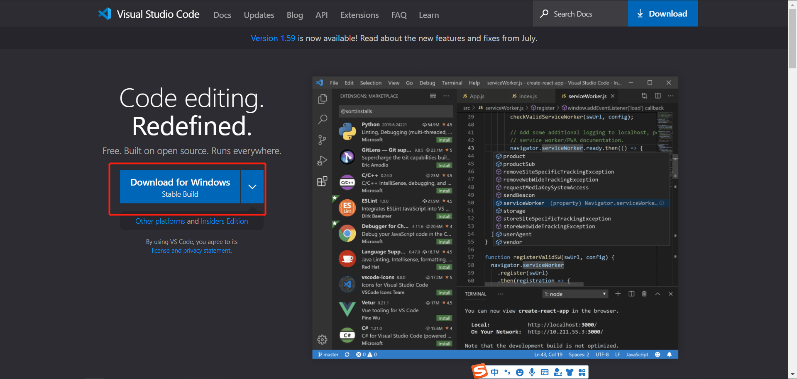

- vscode插件推荐

  - Chinese：实现简体中文

    

  - open in browser：实现右击可以在浏览器预览

  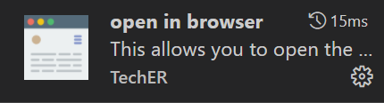

  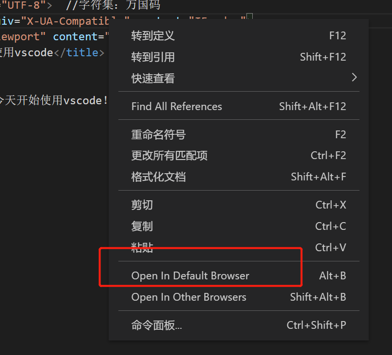

  


### 几个小细节

----


```html
<!DOCTYPE html> 
	文档类型声明标签，告诉浏览器这个页面才去HTML5版本来显示页面

<html lang="zh-CN">
    告诉浏览器或者搜索引擎，这个是一个中文网站，本站采用中文来显示

<meta charset="UTF-8">  
    必须写，UTF-8来保存文字，如果不写就会乱码
```


### HTML常用标签

----


#### 标题标签

HTML提供了6个等级的网页标题

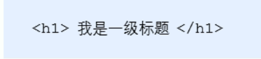

h是单词head的缩写

**特点**

1、变粗变大

2、独占一行

**标签语义**

作为标题使用，并且根据重要性递减


#### 段落标签

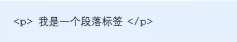

 p是paragraph的缩写

两个段落之间有空格


#### 换行标签

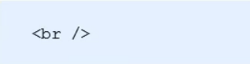

br是break的缩写

是个单标签

只是简单换一个行，两个段落之间不空格


#### 文本格式化标签

##### 粗体

<strong></strong>（语义更加强烈）

 <b></b>

##### 斜体

 <i></i>（语义更加强烈）

 <em></em>

##### 下划线

<ins></ins>（语义更加强烈）

  <u></u>

##### 删除线

<s></s>


#### div和span标签

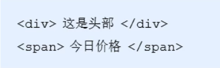

没有语义，当做一个盒子，可以放东西

 div是division的缩写，表示分割

span以为跨度，跨距

##### div

自己独占一行

##### span

一行上可以放很多个


## 第二天

> 时间：2021年8月26日17:28:05


#### 图像标签

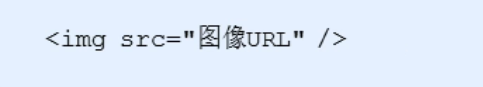

img是image的缩写，意思是图像

src是标签的必须属性，用于指定图像文件的路径和文件名

图像标签的其他属性：

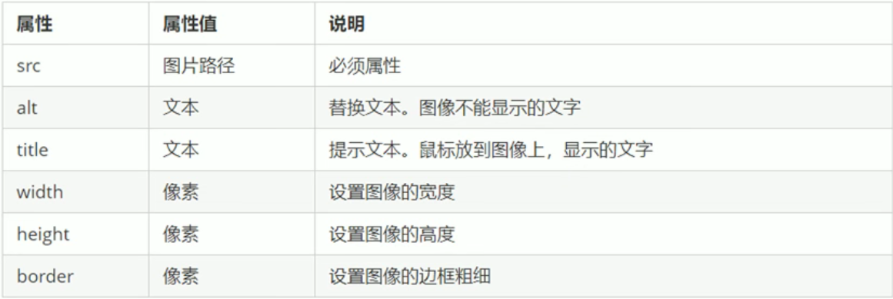

```html


```


注意点：

1. 图像标签可以有多个属性，必须写在标签名后面
2. 属性之间不分先后顺序
3. 采取键值对的格式


#### 路径

1. 目录文件夹：就是一个普通文件夹，只是存放了制作页面需要的相关素材，比如HTML文件，图片等
2. 根目录：打开目录文件夹的第一层就是根目录

##### 分类

1. 相对路径：图片相对于HTML页面的位置

| 相对路径分类 | 符号 | 说明                                                    |
| :----------- | ---- | ------------------------------------------------------- |
| 同一级路径   |      | 图像文件位于HTML文件的同一级           |
| 下一级路径   | /    | 图像文件位于HTML文件的下一级    |
| 上一级路径   | ../  | 图像文件位于HTML文件的上一级 |

2. 绝对路径：

   C:\Users\yjx\Desktop\前端\try\day1\F.png

   https://f000.top/typora/image-20210820122841766.png


#### 超链接标签

```html
<a href="跳转目标" target="目标窗口弹出方式">文本或者图像</a>
```

a是单词anchor的缩写，意思是锚


##### 两个属性

href

---

用于指定连接目标的url地址


target

----

用于指定链接页面的打开方式

- _self为默认值
- _blank为在新窗口中打开方式

```html
 <a href="http://qq.com" target="_blank">腾讯qq</a>
```


##### 链接分类

- 外部链接

```html
 <a href="http://qq.com" target="_blank">腾讯qq</a>
```

- 内部链接

```html
<a href="创建页面.html">内部页面</a>
```

- 空链接

```html
<a href="#">首页</a>
```

- 下载链接：地址链接的是 .exe .zip 形式

```html
<a href="F.zip">下载文件</a>
```

- 网页元素链接

```html
<a href="http://f000.top" target="_blank" title="建兴博客"></a>
```


## 第三天

> 时间：2021年9月22日12:52:49

<hr>


### 列表和表格

---


#### 无序列表 ul （重点）

无序列表的各个列表项之间没有顺序级别之分，是并列的。其基本语法格式如下：

```html
<ul>
  <li>列表项1</li>
  <li>列表项2</li>
  <li>列表项3</li>
  ......
</ul>
```


```html
<p>奥尼尔大学槽点</p>
    <ul>
        <li>
        每晚上指纹打卡   
        </li>
        <li>
        全大学城解封的情况下，依旧封校
        </li>

        <li>
         食堂过少，全校两万多人居然只有两个食堂   
        </li>
    </ul>
```

效果：

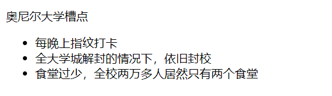


#### 有序列表 ol （了解）

有序列表即为有排列顺序的列表，其各个列表项按照一定的顺序排列定义，有序列表的基本语法格式如下：

```html
<ol>
  <li>列表项1</li>
  <li>列表项2</li>
  <li>列表项3</li>
  ......
</ol>
```

  所有特性基本与ul 一致。  但是实际中比 无序列表 用的少很多。


```
<ol>
<li>吃饭</li>
<li>睡觉</li>
</ol>
```

效果：

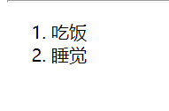

