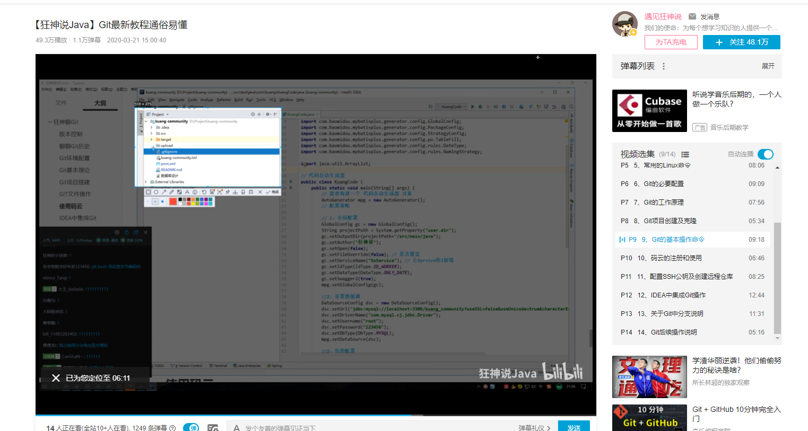
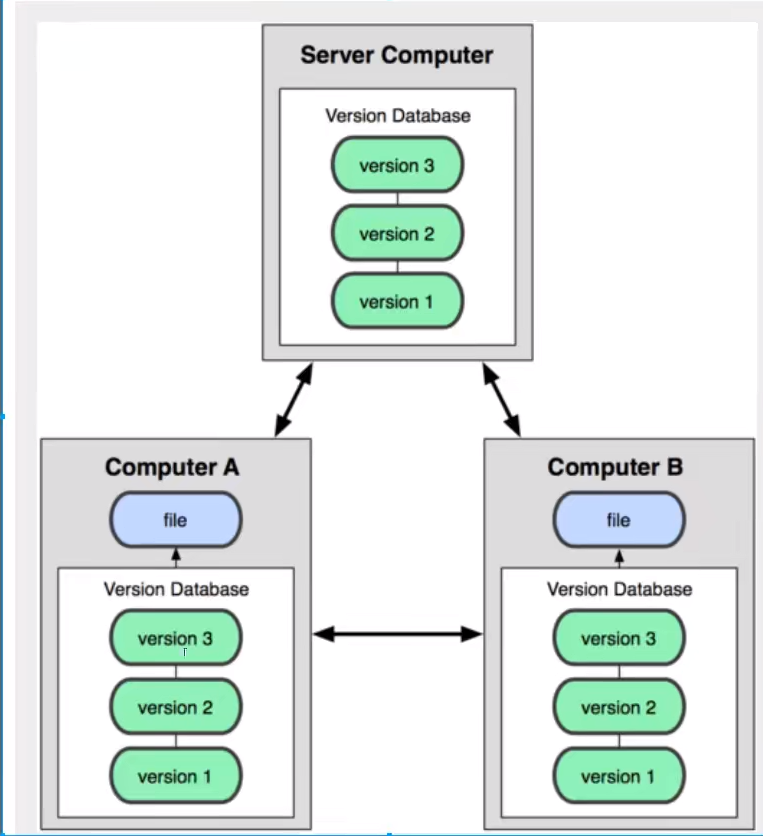

---

**Git和GitHub居然不是同一个东西**:question:

<!--more-->

### 前言：	

作为计算机专业的学生，早就听说过了GitHub的大名，我尝试过注册了几次，但是不知道为什么网络总是会出现错误，打不开，就放弃了。直到我找到v2rayN，用上了稳定的梯子之后，才开始深入了解。

Git和GitHub其实是两个东西！我也是学习过之后才发现的。

我学习的课程是bilibli上up主狂神说录制的，比较短小，讲课风格也很不错！

### 笔记

#### 1、集中版本控制

 缺点：用户本地只有自己以前同步的版本，一旦服务器挂了就有点麻烦

代表： SVN 

#### 2、分布式版本控制

每个人都有全部代码（有安全隐患，怕员工跑路，哈哈哈）

####  3、git是目前最先进的分布式版本控制系统

#### 4、git历史

linux内核维护工作者觉得提交补丁和保存归档是很繁琐的事务——2002年开始启用Bitkeeper来管理和维护代码——后面Bitkeeper结束了和linux的合作关系——然后Linux的缔造者Linus Torvalds花了两个星期搞出来了git

#### 5、git的及环境配置

git bash ：unix与linux风格

git cmd：windows风格

git gui：图形化风格

#### 6、基本Linux命令学习

cd：改变目录

cd .. ：退回上一级目录

clear：清屏

exit：退出

history：查看历史

touch：新建一个文件

mkdir：新建一个文件夹

rm -r：删除文件

rm -rf （这个命令在 Linux下不要尝试）

#### 7、Git文件操作😂

> 文件的四种状态

