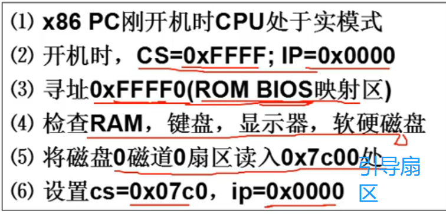
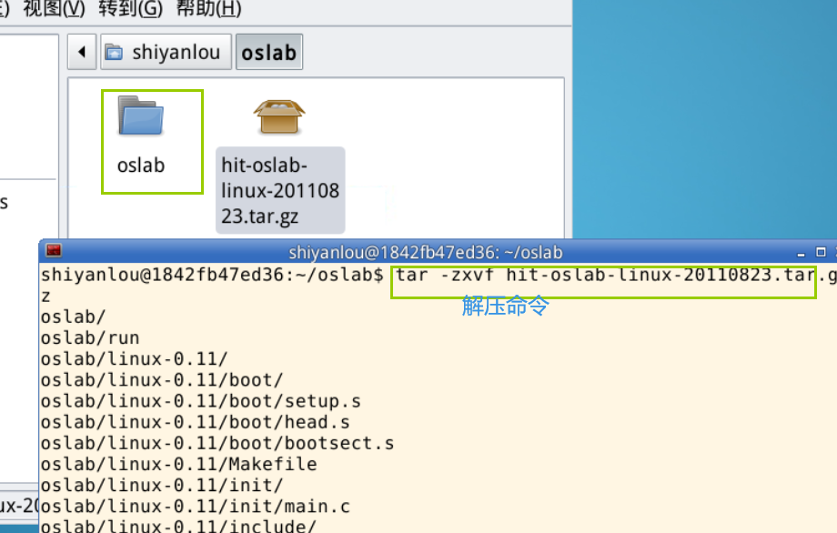
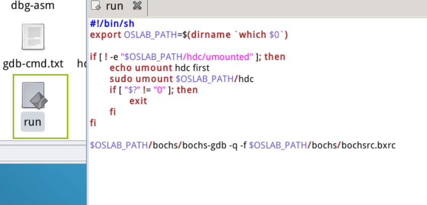
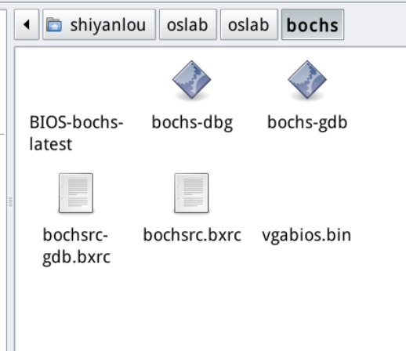
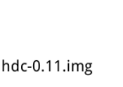
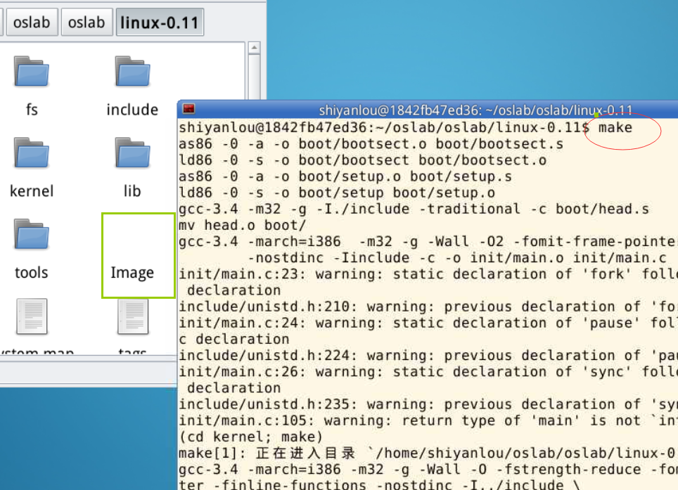
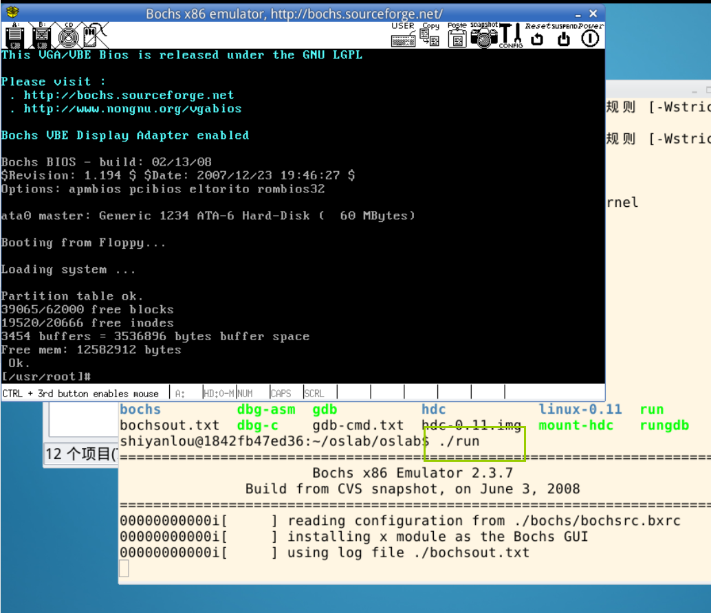
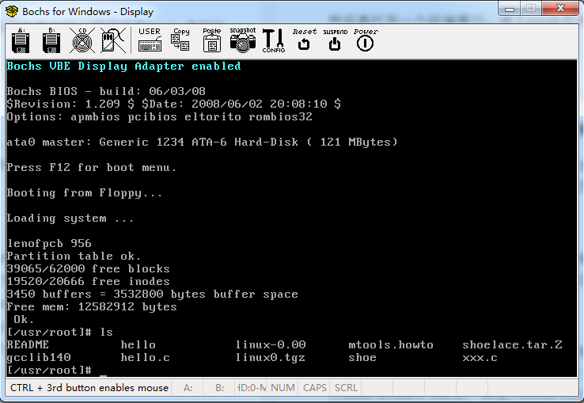

# Lab1

### 理论部分

操作系统的启动

为什么用汇编语言，不用C语言？——可以严格控制要执行什么

#### 1、打开电源计算机执行的第一个指令是什么？

实模式和保护模式对应，；两种模式的寻址方式不一样，cs左移4位+IP



#### 2、引导扇区

 0x7c00处，就是从磁盘引导扇区读入的512字节

bootsect.s（翻译就是引导扇区）

.s是什么文件？ ——汇编代码

```assembly
mov ax, #BOOTSEG //也就是ax=0x07c0v
mov ds, ax
mov ax, #INITSEG
MOV ES ,AX


BOOTSEG=0X07C0
```

## 操作系统的启动

计算机的工作：取指令——执行指令

通电后第一步干的就是：把操作系统从磁盘，拿到内存里面


```assembly
//setup.s
MOV AH ,#0X88 int 0x15 mov [2],ax... //获取内存的大小
```


# 实验部分

```she
怎么解压
tar -zxvf 
```

## 实验环境

1. x86模拟器bochs

   Bochs 是一个免费且开放源代码的 IA-32（x86）架构 PC 机模拟器。在它模拟出的环境中可以运行 Linux、DOS 和各种版本的 Windows 等多种操作系统。Bochs 的是模拟器，其原理决定了它的运行效率会低于虚拟机。

   [bochs主页是](https://bochs.sourceforge.io/)

2. GCC编译器

   GCC 是和 Linux 一起成长起来的编译器。Linux 最初的版本就是由 GCC 编译的。现在 GCC 也是在自由软件领域应用最广泛的编译器。

3. GDB 调试器

   是 GCC 编译器的兄弟。做为自由软件领域几乎是唯一的调试器，它秉承了 Unix 类操作系统的一贯风格，采用纯命令行操作，有点儿类似 dos 下的 debug。

4. Ubuntu 

   也许不是目前最好用的 Linux 桌面发行版，但它一定是最流行的。主要特点是易用，非常的易用。现在，已经有越来越多的人开始用 Ubuntu 完全代替 Windows，享受更加自由、安全、守法的感觉。


## 实验环境熟悉

1、解压




2、run脚本

run 是运行 bochs 的脚本命令。

运行后 bochs 会自动在它的虚拟软驱 A 和虚拟硬盘上各挂载一个镜像文件，软驱上挂载是 linux-0.11/Image，硬盘上挂载的是 hdc-0.11.img。

因为 bochs 配置文件中的设置是从软驱 A 启动，所以 Linux 0.11 会被自动加载。

而 Linux 0.11 会驱动硬盘，并 mount 硬盘上的文件系统，也就是将 hdc-0.11.img 内镜像的文件系统挂载到 0.11 系统内的根目录 —— `/`。在 0.11 下访问文件系统，访问的就是 hdc-0.11.img 文件内虚拟的文件系统。


3、bochs 目录



bochs 目录下是与 bochs 相关的执行文件、数据文件和配置文件。


4、hdc-0.11.img 文件

hdc-0.11.img 文件的格式是 Minix 文件系统的镜像。

Linux 所有版本都支持这种格式的文件系统，所以可以直接在宿主 Linux 上通过 mount 命令访问此文件内的文件，达到宿主系统和 bochs 内运行的 Linux 0.11 之间交换文件的效果。

Windows 下目前没有（或者是还没发现）直接访问 Minix 文件系统的办法，所以要借助于 fdb.img，这是一个 1.44M 软盘的镜像文件，内部是 FAT12 文件系统。将它挂载到 bochs 的软驱 B，就可以在 0.11 中访问它。而通过 filedisk 或者 WinImage，可以在 Windows 下访问它内部的文件。

hdc-0.11.img 内包含有：

- Bash shell；
- 一些基本的 Linux 命令、工具，比如 cp、rm、mv、tar；
- vi 编辑器；
- gcc 1.4 编译器，可用来编译标准 C 程序；
- as86 和 ld86；
- Linux 0.11 的源代码，可在 0.11 下编译，然后覆盖现有的二进制内核。



5、编译内核

进入linux-0.11目录，然后执行make



产生Image 文件

oslab 工作在一个宿主操作系统之上，我们使用的 Linux，在宿主操作系统之上完成对 Linux 0.11 的开发、修改和编译之后，在 linux-0.11 目录下会生产一个名为 **Image** 的文件，它就是编译之后的目标文件。

该文件内已经包含引导和所有内核的二进制代码。如果拿来一张软盘，从它的 0 扇区开始，逐字节写入 Image 文件的内容，就可以用这张软盘启动一台真正的计算机，并进入 Linux 0.11 内核。

> oslab 采用 bochs 模拟器加载这个 Image 文件，模拟执行 Linux 0.11，这样省却了重新启动计算机的麻烦。


6、运行

oslab下运行 run脚本



此时bochs运行Linux-0.11成功！hello linux-0.11!


7、文件交换

接下来讲解一下 Ubuntu 和 Linux 0.11 之间的文件交换如何启动。

> 开始设置文件交换之前，务必关闭所有的 Bochs 进程。

oslab 下的 `hdc-0.11-new.img` 是 0.11 内核启动后的根文件系统镜像文件，相当于在 bochs 虚拟机里装载的硬盘。在 Ubuntu 上访问其内容的方法是：

```bash
$ cd ~/oslab/

# 启动挂载脚本
$ sudo ./mount-hdc
```

> 大家使用 sudo 时，password 是 `shiyanlou`，也有可能不会提示输入密码。

之后，hdc 目录下就是和 0.11 内核一模一样的文件系统了，可以读写任何文件（可能有些文件要用 sudo 才能访问）。

```bash
# 进入挂载到 Ubuntu 上的目录
$ cd ~/oslab/hdc

# 查看内容
$ ls -al
```

读写完毕，不要忘了卸载这个文件系统：

```bash
$ cd ~/oslab/

# 卸载
$ sudo umount hdc
```

经过 `sudo ./mount-hdc` 这样处理以后，我们可以在 Ubuntu 的 hdc 目录下创建一个 xxx.c 文件，然后利用 Ubuntu 上的编辑工具（如 gedit 等）实现对 xxx.c 文件的编辑工作，在编辑保存以后。

执行 `sudo umount hdc` 后，再进入 Linux 0.11（即 run 启动 bochs 以后）就会看到这个 xxx.c（即如下图所示），这样就避免了在 Linux 0.11 上进行编辑 xxx.c 的麻烦，因为 Linux 0.11 作为一个很小的操作系统，其上的编辑工具只有 vi，使用起来非常不便。



图 2 用 Ubuntu 和 Linux 0.11 完成文件交换以后再启动 Linux 0.11 以后

另外在 Linux 0.11 上产生的文件，如后面实验中产生的 `process.log` 文件，可以按这种方式 “拿到” Ubuntu 下用 python 程序进行处理，当然这个 python 程序在 Linux 0.11 上显然是不好使的，因为 Linux 0.11 上搭建不了 python 解释环境。

> 注意 1：不要在 0.11 内核运行的时候 mount 镜像文件，否则可能会损坏文件系统。同理，也不要在已经 mount 的时候运行 0.11 内核。
>
> 注意 2：在关闭 Bochs 之前，需要先在 0.11 的命令行运行 “sync”，确保所有缓存数据都存盘后，再关闭 Bochs。


