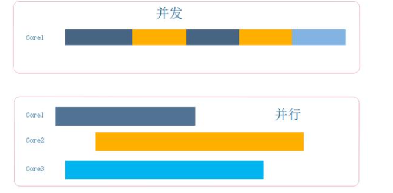

## 软件工程概论

2022年4月4日16:28:12

顺序图（需求）：参与者和系统的**消息交互**

活动图（需求）：系统动作描述，从头到尾走一遍

case study：学习（copy code）和模仿，之后作出创新，不一样的东西

如果没有例子呢？那就要estimation，评估。

并发：实际上只是在做一件事情，但是由于CPU切换的太快，以至于感觉到在做很多事情

并行：应该是多核心的处理器，就具备了同时处理多个任务的能力，这些任务彼此不会相互干扰

传统过程模型：

1. 开发模型(从无到有)：瀑布、V、喷泉、增量

   

2. 演化模型：(东西已经有了，不断更新换代和优化)

   原型

   并发(concurrent)：强调变更，change，需求经常变更

   螺旋(the spiral):一圈一圈慢慢变大

敏捷模型：

1. srum：增量、迭代

   1. 透明——任务看板

      - 领歌
        - 用户故事user story
        - 产品backlog
        - devops
        - 燃尽图

   2. 检验

      找问题、优化

   3. 适应

2. xp

   xp设计

   - kiss法则
   - CRC card(class-responsibility-)
   - spike solutions:攻克难题
   - refactoring:重构，1.0——>2.0

   xp coding

   - pair programming :绝对编程
   - test
   - customer join顾客的参与挺多

   AOSD：面向方面(切面)的软件开发

   Unified Process(UP):统一过程模型,厚重？

3. 软件过程评估process assessment and improvement

> about home work
>
> ppt
>
> 案例报告，工作量说明
>
> 案例使用说明，不占分

[scrum leangoo](https://www.leangoo.com/) 

[什么是Scrum](https://www.scrumcn.com/agile/scrum-knowledge-library/什么是scrum.html)

[如何实施 SCRUM ？](https://www.zhihu.com/question/19638322/answer/759271217)

[软件架构](http://www.ruanyifeng.com/blog/2016/09/software-architecture.html)

- 分层架构，最常见的
- 事件驱动架构
- 微核架构
- 微服务架构

架构：

逻辑：功能需求，怎么实现？---类、类图

数据：数据需求，ERD

物理：硬件

开发：第三方库、	

运行

[逻辑架构、开发架构、运行架构、物理架构、数据架构](https://wenku.baidu.com/view/35e5859f1937f111f18583d049649b6648d709fe.html)

