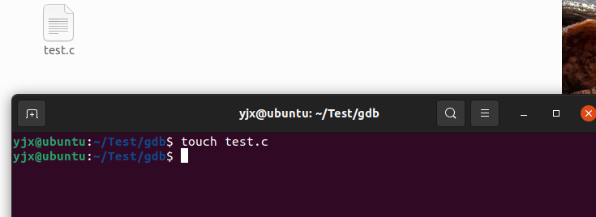
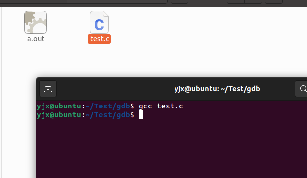
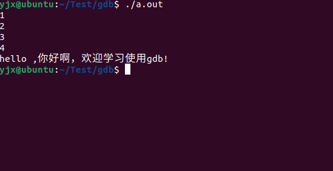
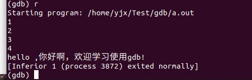
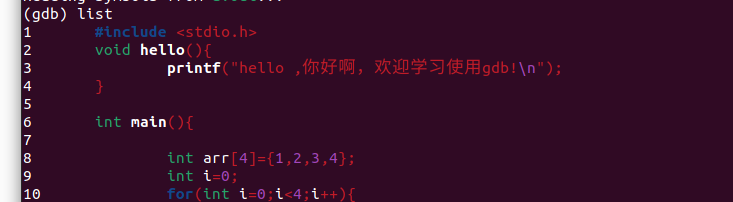
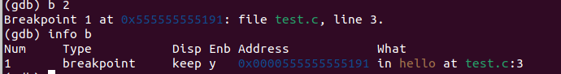
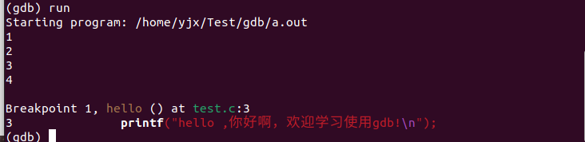
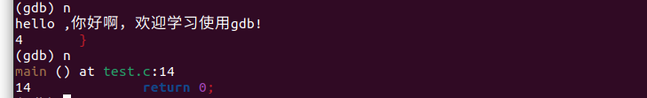

GDB是一个调试工具，但是以前我从来都没有听说过。因为写代码一般都是在IDE里写，可以调试运行

，而且是图形化的操作，方便我这种菜鸟。

但是因为上课需要所以就来学了一下，GDB是纯命令行的，而且是在Linux系统下，一般人也不会用

Linux吧，确实是有那么有点难度hhh。


### 官方文档

http://www.sourceware.org/gdb/

运行

```
gdb a.out
```


### 安装

```
sudo apt-install gdb //Ubuntu系统下
```


### 常用命令

```
run(r) //运行程序
```

```
quit(q) //退出gdb模式
```

```
list 查看源代码
```

```
break(b) //打断点
```

```
info b //查看断点的情况
```

```
next(n) //下一步
```

```
man gdb //翻阅一下gdb的命令手册
```

``` 
print(p) //查看数值
```

```
p & //查看位置
```

```
set logging on 查看日志
```

```
watch * 设置一个断点，然后这个值的断点变化了就会在屏幕上显示出来
```


### 使用示例

```
touch test.c 创建一个c语言的文件 叫做test.c
```



```
vim test.c 使用vim打开文件（里面是空的）
```

然后在里面输入代码：

```c
#include <stdio.h>
void hello(){
	printf("hello ,你好啊，欢迎学习使用gdb!"\n);
}

int main(){

	int arr[4]={1,2,3,4};
	int i=0;
	for(int i=0;i<4;i++){
		printf("%d\n",arr[i]);
	}
	hello();
	return 0;
}
```

编译

```
gcc -g test.c
```



尝试运行一下

```
./a.out
```



进入gdb模式

```
gdb a.out
```

```
gdb r  运行
```



```
list 看看代码（如果代码太长了可以多输入几次list才能完全展示）
```




```
b 2 //在2行设置一个断点
info b //查看断点
```



```
run一下
```



发现程序卡在hello这个函数这里了

```
n  //两下
```



函数继续执行

然后把断点打在第10行：这个位置

```
for(int i=0;i<4;i++){
```

执行获得一下代码

```
//在第10行打断点
(gdb) b 10
Breakpoint 1 at 0x11de: file test.c, line 10.
//运行
(gdb) run
Starting program: /home/yjx/Test/gdb/a.out 

Breakpoint 1, main () at test.c:10
10		for(int i=0;i<4;i++){
//下一步
(gdb) n
11			printf("%d\n",arr[i]);
(gdb) n
1
10		for(int i=0;i<4;i++){

//看i的值，现在是0
(gdb) p i
$1 = 0
(gdb) n
11			printf("%d\n",arr[i]);
(gdb) n
2
10		for(int i=0;i<4;i++){
//再看看i的值，现在变成了1
(gdb) p i
$2 = 1
```

就可以看见p的值的变化

```
//看i的地址
(gdb) p &i
$3 = (int *) 0x7fffffffdfd8

//使用 watch
(gdb) watch * 0x7fffffffdfd8
Hardware watchpoint 2: * 0x7fffffffdfd8

//查看在哪里有watchpoints
(gdb) info watchpoints
Num     Type           Disp Enb Address            What
2       hw watchpoint  keep y                      * 0x7fffffffdfd8

//继续下一步
(gdb) n

Hardware watchpoint 2: * 0x7fffffffdfd8

//发现作出了改变，原来是1现在变成了2（其实就是i++在起作用
Old value = 1
New value = 2
0x0000555555555207 in main () at test.c:10
10		for(int i=0;i<4;i++){


```

