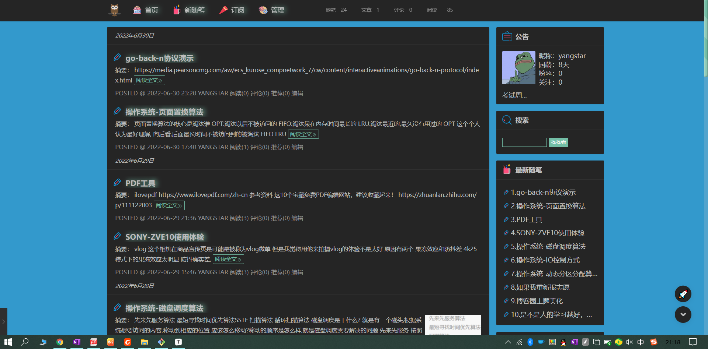
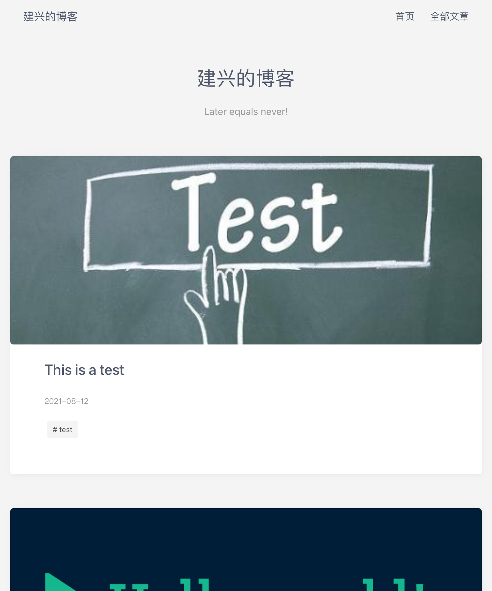

hexo给我留下了很多美好的回忆,我在这里书写文字已经有323天啦!

这快一年的时间,我进步了很多,翻看以前的文章满满都是回忆.

它好像不能被搜素引擎所找到,更像是我的一个笔记库

---

但是由于hexo是静态的网页,每次写文章都很麻烦

随意我决定停止用hexo继续写文章

---

我的新博客将放在博客园:

网址是: www.cnblogs.com/yangstar

这个一个动态的博客,无论是在手机上还是电脑上,随时随地都可以更新,给了我更多写作的乐趣,而不是把精力放在博客的配置上

---

不知道以后我还会不会再这个网页上更新的

一是因为我的域名www.f000.top快到期了

我决定不在给他续费,我想买一个新的域名,暂时决定是这个www.yangstar.top(.cn的域名被人买了)

我会把域名解析到我博客园的首页

二是我更换电脑了,不知道以后能不能愉快的把hexo搬过去,如果不能,这可能是我最后一次更新了

---

我爱这个网站,虽然不是我自己写的主题,但是在它上面留下了我探索的脚步,是我一次一次的摸索才搞出来的,让我再次爱上了computer,之中遇到了很多bug,但

是最后都能解决,真的很不容易,对我这么一个动手能力一般的人来说,哈哈哈哈

----

最后一下你可以通过更多方式联系到我:

bilibili:https://space.bilibili.com/447570181

wechat:goodmaele

email:goodmale@qq.com

---

最后感叹一下时间过得真快,323多天一瞬而过,要不是有这个博客,写下了一些文章,可能更多经历的瞬间都已经遗忘

这是书写的意义,继续前进的同时,也未曾忘记曾经.

愿只如初见:

