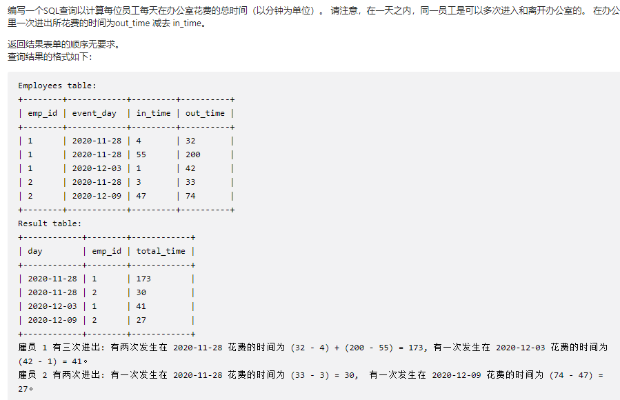
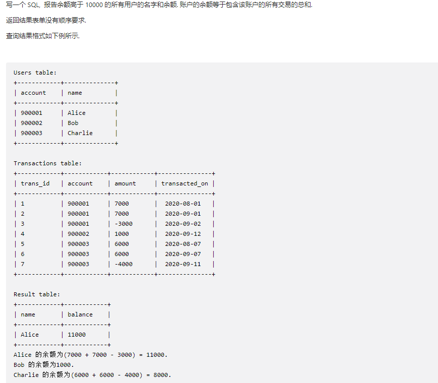
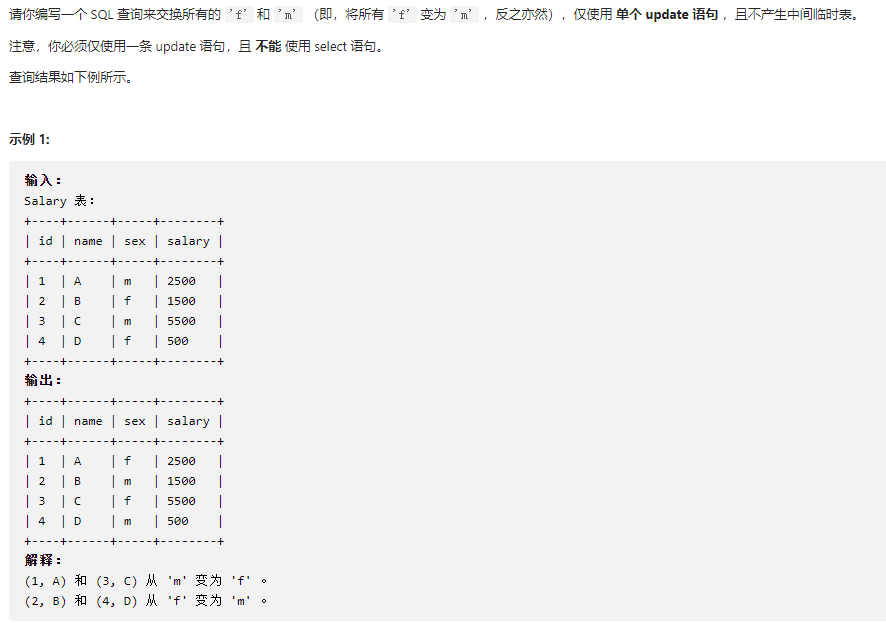
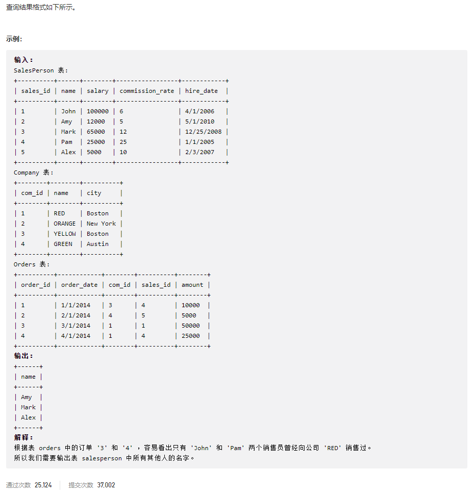
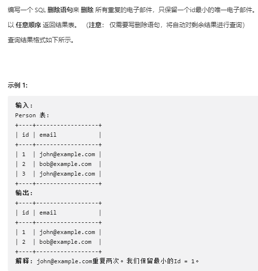
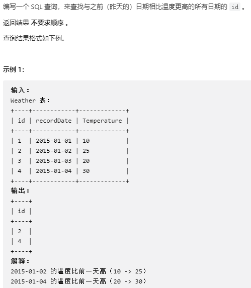

## 数据库

time:2022年5月17日23:03:25

#### [1741. 查找每个员工花费的总时间](https://leetcode.cn/problems/find-total-time-spent-by-each-employee/)



> 很简单，给表起别名用as

```sql
# Write your MySQL query statement below
select event_day as day,emp_id,sum(out_time-in_time) as total_time
from employees
group by event_day,emp_id
```


#### [1587. 银行账户概要 II](https://leetcode.cn/problems/bank-account-summary-ii/)



```sql
# Write your MySQL query statement below
select  users.name, sum(amount) as balance
from transactions join users on (transactions.account=users.account)
group by transactions.account
having sum(amount)>10000 #聚合函数要用having 不用where
```


time:2022年5月18日19:34:53

#### [627. 变更性别](https://leetcode.cn/problems/swap-salary/)



> 这题主要是学在sql中的if语句，case语句
>
> 参考资料：[如何按条件修改数据？](https://leetcode.cn/problems/swap-salary/solution/tu-jie-sqlmian-shi-ti-ru-he-an-tiao-jian-xiu-gai-s/)

```sql
#one:用if，这个不是太理解
update salary
set sex=if(sex='m','f','m')

#two:用case
update salary
set sex=(
case sex
    #m变成f
    when 'm' then 'f'
    #剩下的都f，把f都变成m
    else 'm' 
end   
)
```


#### [607. 销售员](https://leetcode.cn/problems/sales-person/)



> 这题主要就是有很多的表

```sql
# Write your MySQL query statement below
select name 
from salesperson 
where sales_id not in 
(select sales_id from orders where com_id in 
(select com_id from company where name ='red'))
```


time:2022年5月22日12:16:31

#### [196. 删除重复的电子邮箱](https://leetcode.cn/problems/delete-duplicate-emails/)



> 怎么删除？,这里弄了两个表p1，p2，不知道是不是临时的一个表

```sql
DELETE p1
from person as p1,person as  p2
where p1.email=p2.email and p1.id>p2.id
```

#### [197. 上升的温度](https://leetcode.cn/problems/rising-temperature/)



> datediff求两个日期相差的天数，判断条件和上面那题差不多

```sql
select w2.id
from weather as w1,weather as w2
# 结果要满足两个条件：第二天的气温高， 两个日期相差一天(用了datediff这个东西）
where w1.temperature<w2.temperature and datediff(w2.recordDate,w1.recordDate)=1
```

