这个是一个台湾up主的一期节目，介绍了一下挖矿的种种事情，链接如下：

[台灣挖礦紀錄片！從崩跌礦難到月入百萬！實際採訪五個千萬等級的大型礦場](https://www.youtube.com/watch?v=IBA3k7GBsWc)

天下熙熙皆为利往，对财富的追求必然导致人类的投机的渴望

正常的工作上班，根本不能实现财富自由，只有投机才能有意思希望

比特币这一波虚拟货币我确实是错过了，或许是我的年龄太小，或许我的资金不足，目前来说能够从里面学到一些东西就好                      

​                                           

## 矿场2 

电费20万台币，收益可以在100万上下左右

价值观偏差，30%很平稳

长线看多，但是波动很大

## 矿场3

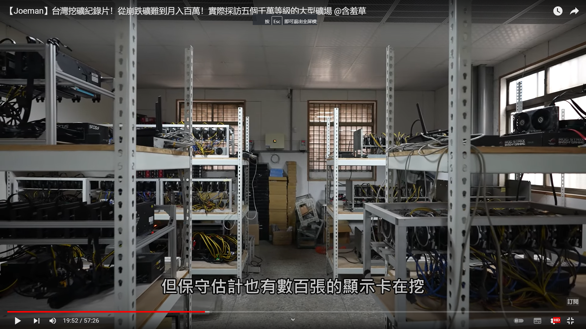

规模没有前两个大，但是保守也有数百张显卡在挖

比较保守

矿难，和参与挖矿的人增加会导致收益减少

2018年矿难，以太币跌倒100美金

包哥就是2018年后接手别人的矿场

圈子很小

管理系统很方便

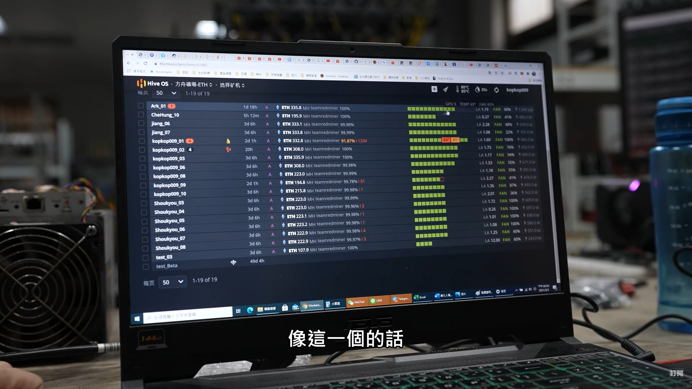

很清晰的显示每张卡的状态

## 主持人自己挖矿

毛利70%左右的利润，懵逼了主持人的心

一个3070ti的收益

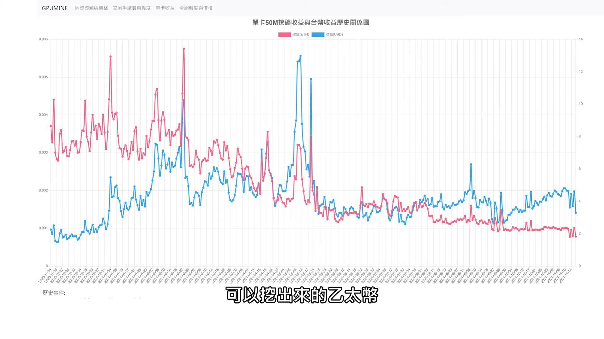

一个月可以有120美金左右的收入。

右边就是up的矿机

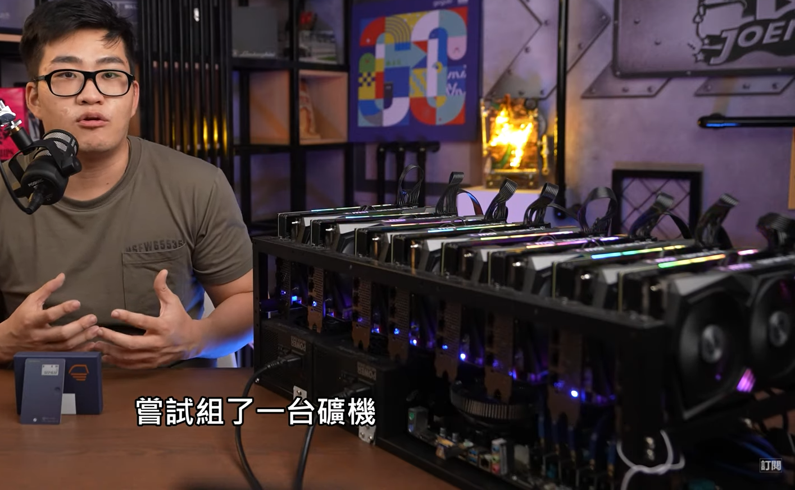

总共是26万台币

挖出矿之后会让人想要继续价码，一种美妙的感觉

但是散热不好，要自己学习怎么操作，导致家里的温度也比较高，家里开空调，因为是阶梯用电，所以导致up交了10万的电费

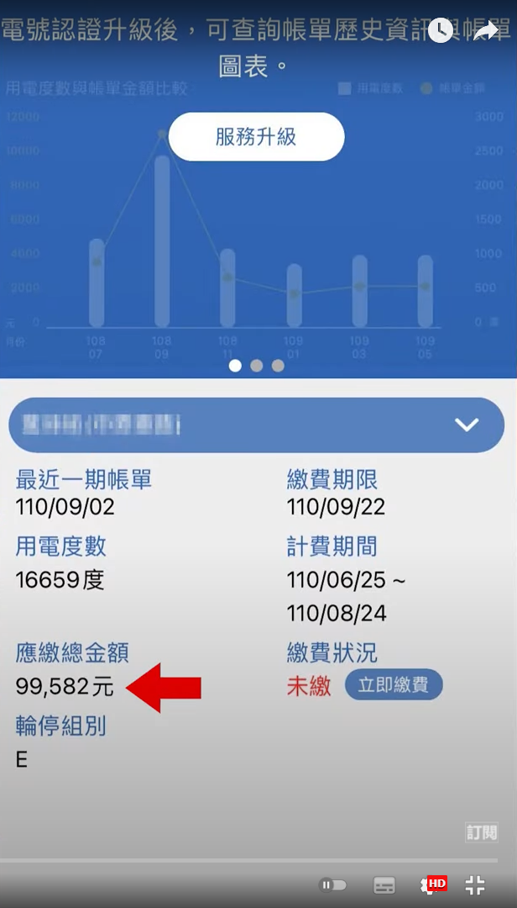

差不多是2万人民币

然后up就把他的矿机托管给了包哥，哈哈哈哈

最终up主，投入290万台币，差不多60万人民币左右，半年时间挖了快200万，如果他后面还可以把带有腹肌的显卡卖了那确实很划算。估计就是原价卖了，羡慕了。

这里的思维完全和显卡吧里面的人不一样，在这里显卡变成了生产资料，变成了农场里面的奶牛，一刻也不停的在寄出他们的“奶”，两方完全不一样的人看问题肯定是完全不一样，我之前确实也很痛恨这些矿老板，但是现在换一个角度看，他妈的这么高的收益，谁不想干啊

## 风险

矿池：联合矿工去一起挖。

资金的疯狂

中国大陆的矿场规模可以达到上千台矿机

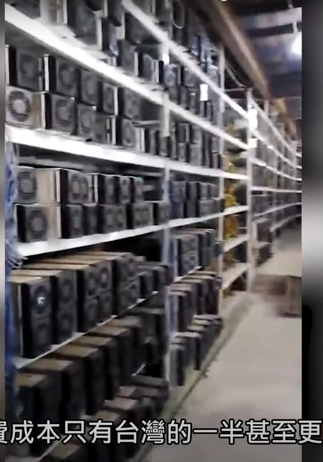

而且直接建设在水电站旁边，电费更加的便宜

这位老哥的策略：挖到就留着

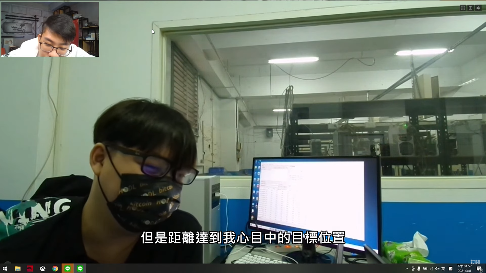

中国大陆为了打击洗钱，直接打击了挖矿，导致当时以太坊算例的大跌

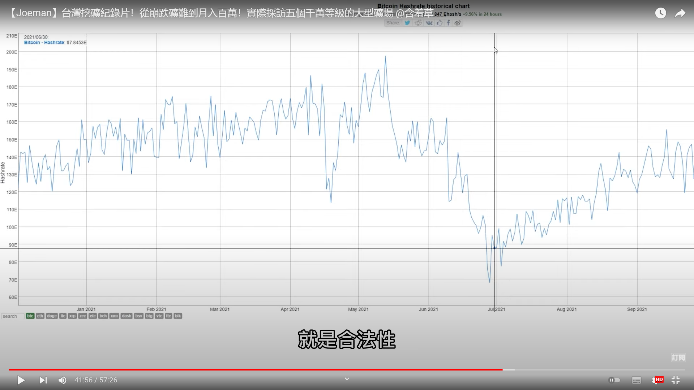

有关矿难：

pow:proof of work 工作证明,也就是现在的挖矿，然后赚取手续费

pos:proof of stake 权益证明共识，质押以太币，优点是省电

## 矿场4

原来是网咖的老板，因为疫情而歇业，现在直接自己来挖矿，有那么一丝搞笑hhh

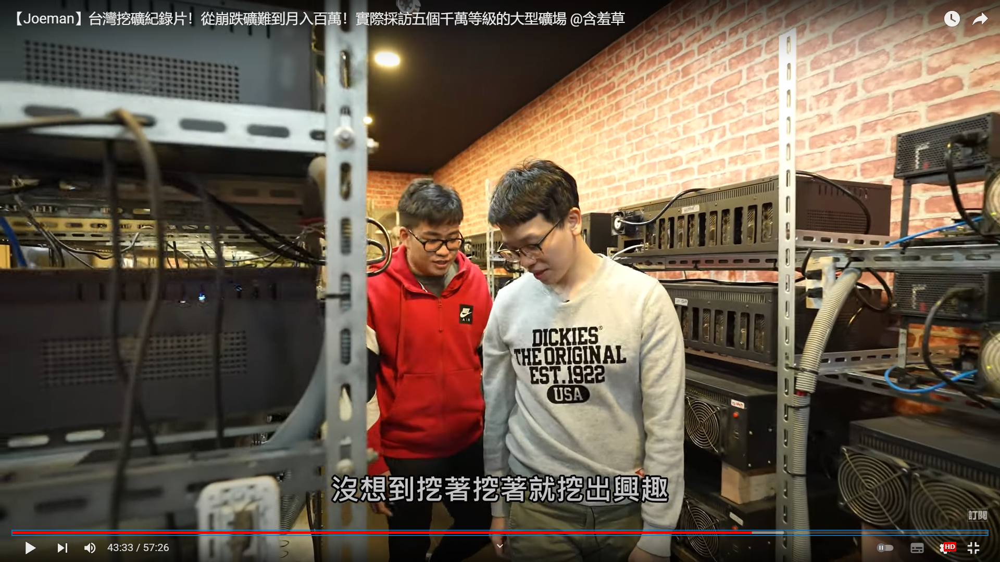

他这个矿场都是新卡，建成的成本在2000万左右(400wRMB)

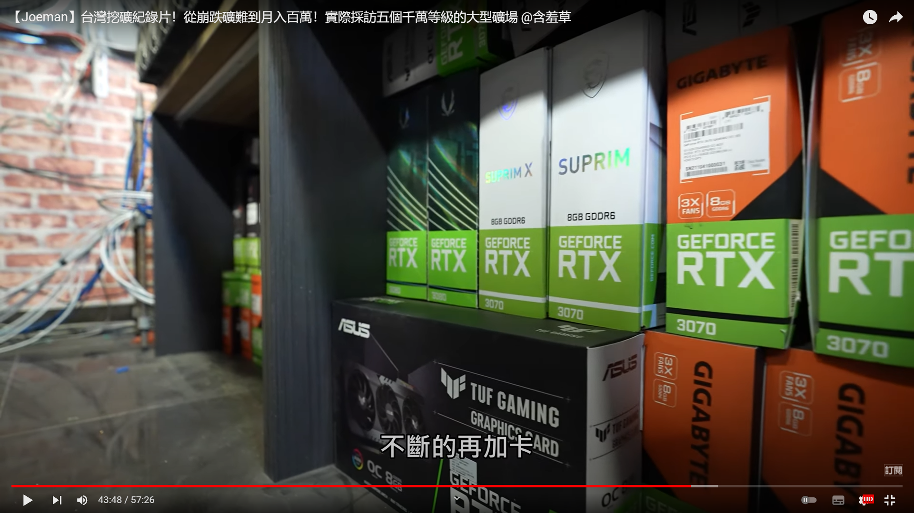

反正人都会死，你难道就不活了吗？还挺有哲理

这个矿老板他爸玩了几个月，跟着赚钱了，也开始真香了，开始爱上投机了

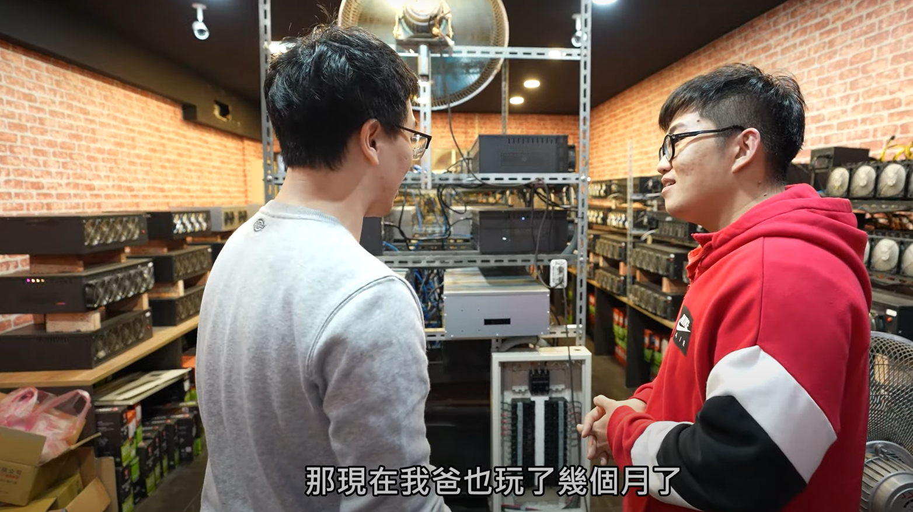

## 矿场5

也是搞自媒体，矿场价值超过5000万台币，但是一开始也被割了韭菜，40万一个的3070。

这个矿老板以前还是搞娃娃机的，但是疫情搞了他很难受，现在就完全没有搞这个项目了

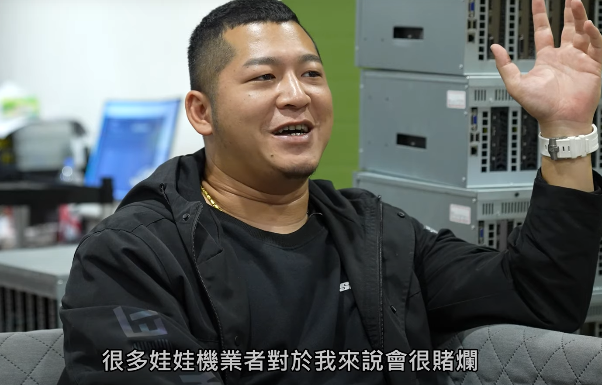
