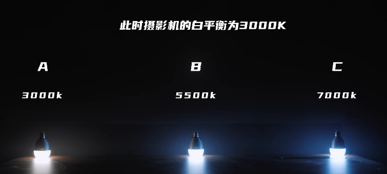

## 前言

我认为我一直很喜欢摄影，但是之前可能不能叫做摄影，只能叫做记录生活，手机拍的很方便，我也用我的手机拍下了超级多的瞬间，但是呢，上限很低，想要更棒，至少得是一个ASPC或者M43画幅的相机吧。

另外摄影真的很烧钱，像适马的三剑客，一个差不多要两千多，确实很贵，好在还有手动镜头，光圈也大，成像素质也还行(至少比大清光学好得多)，发点社交平台够够的了。

# 摄影笔记的笔记

测光方式：智能测光、中央重点平均测光、点测光

### 不同的档位

1、M挡手动：曝光、光圈、快门速度、感光度可以自己调整

2、AV(A)挡：光圈优先，固定光圈大小，相机为你设置快门速度

3、TV挡：快门优先，固定快门速度，相机为你自动设置适合的光圈

## 曝光三要素

### 光圈

1、简介

光圈越大，开的孔就越大，进来的光线就越多

但是光圈的孔径大小，和光圈f/后面的数值是成反比的

2、设定原则

### 曝光值

EV值(exposure value)，代表能够给出同样曝光的相机光圈和快门组合

每个EV亮度差两倍

1EV:18%灰的2倍

-1EV：18%灰的1/2

### 快门速度

## 光

### 1、强度(明暗程度)

与光源的距离、传播介质决定

### 2、方向

一、顺光:

也叫平光，正面光，就是光线从模特正前方射过去，会把面部拍平，色彩比较真实。

二、逆光：

也叫做背光，具有艺术魅力，较强的表现力的光照，让画面产生绚丽的光影效果，一般用来表达浪漫氛围或者安静的画面

三、侧光：

让人物面部呈现立体效果，过度更加细腻

90°侧光：光从拍摄物左右两侧照射过来。

### 3、色温(color)

#### a.简介

它的由来好像是加热一个绝对黑体，黑体会变色，从红到白再到蓝，hhh，这让我想到了骨灵冷火和海心焰。

反正暖色系的光温度低，冷色系的光温度高，简称高冷

#### b.白平衡和色温有什么关系？

灯的色温和摄影机的白平衡数值差不多时，拍摄出来的画面就是白光

参考资料：

[【硬核科普】为什么你拍的视频颜色不好看？99%的人都会忽视这个原理！](https://www.bilibili.com/video/BV1Fv411H7P5?spm_id_from=333.337.header_right.history_list.click)

### 4、常见光线

a.伦勃朗光

b.耶稣光

# 关于设备

我现在的手动镜头确实只适合自己一个人慢慢的拍摄，这种确实有陶冶情操的感觉，缓缓的转动对焦环，然后看着屏幕上的物体慢慢变得清晰，这种感觉太棒了，但是如果是出去旅游的话，还是有个自动对焦的镜头好些，毕竟有些场景总是一闪而过，而且拍人的话摆拍实在是有那么一丝僵硬。

初步来说我现在两个镜头，一个套头，一个铭匠35mmf1.4，我觉得现在已经够用了，但是感觉自拍的aroll镜头还差一个，我是看了一个铭匠17mmf1.4，不知道没有自动对焦行不行，另外昨天我也发现了还有很多的廉价镜头，比如什么海鸥、凤凰(这个他妈的不是自行车品牌吗)，差不多才200左右就可以买到50mmf1.7左右的镜头了，只不过是二手的而已，可以买来试试，熟悉一下焦段。

焦段的话感觉现在的35mm确实有点尴尬，不长也不短，拍人像感觉有点近了，自拍有感觉要离相机太远的距离。但是它确实是最便宜的一个选择，才350元。但是以后我估计会用一个17mm和一个50mm代替它吧。

