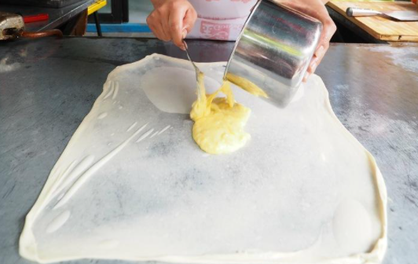
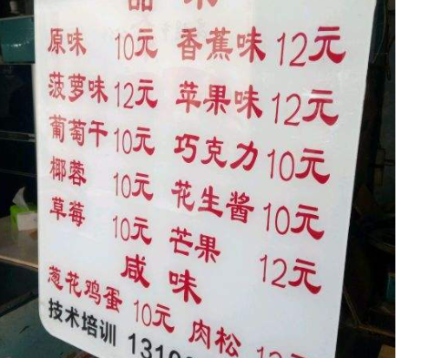
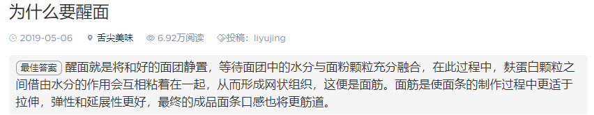
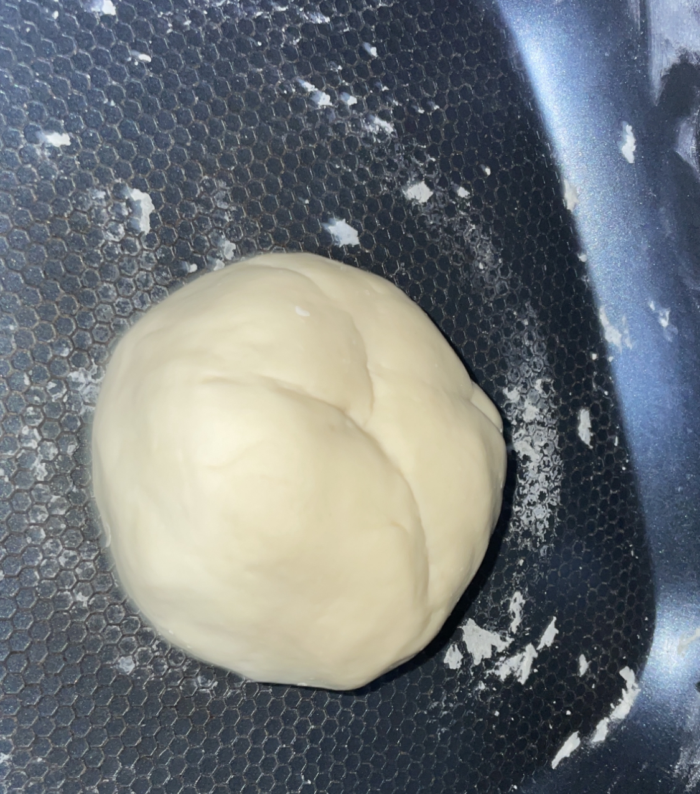
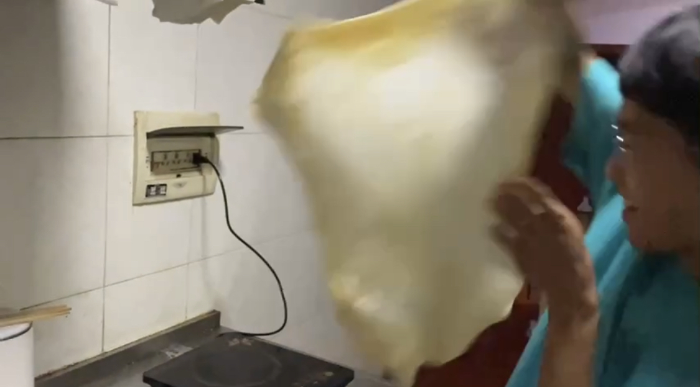
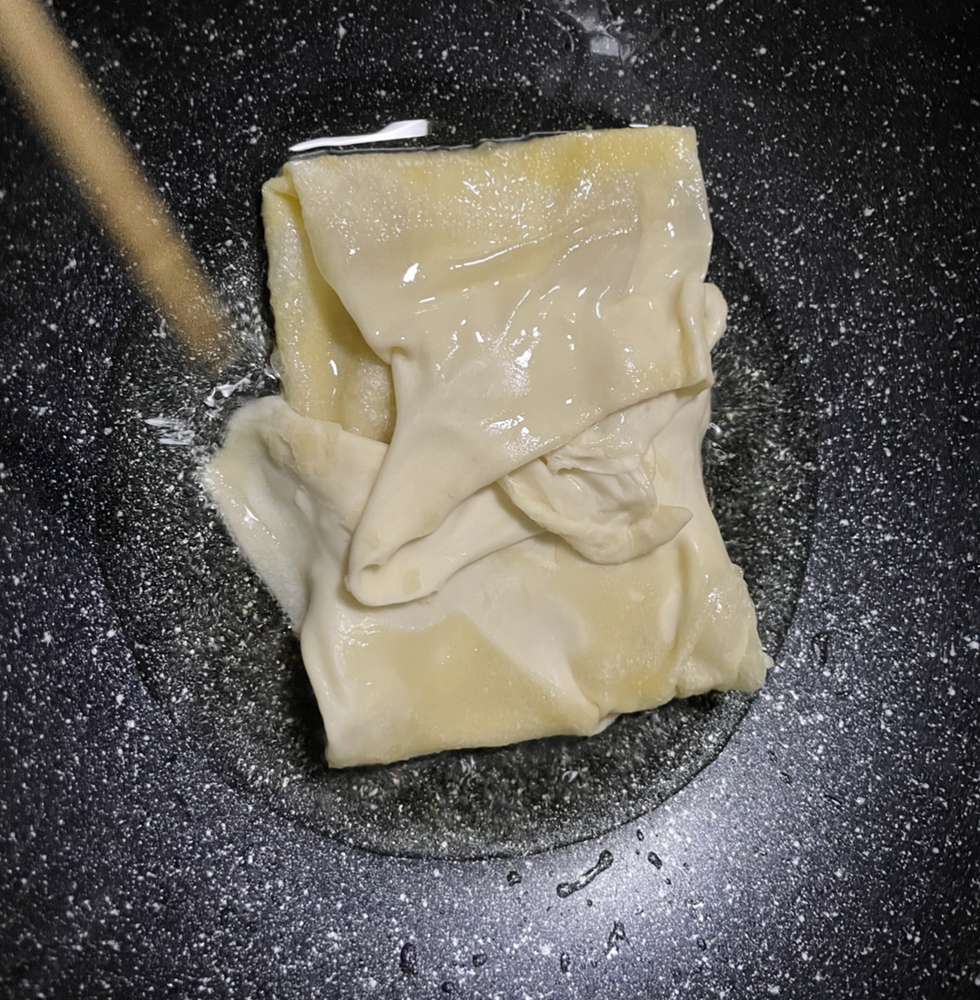
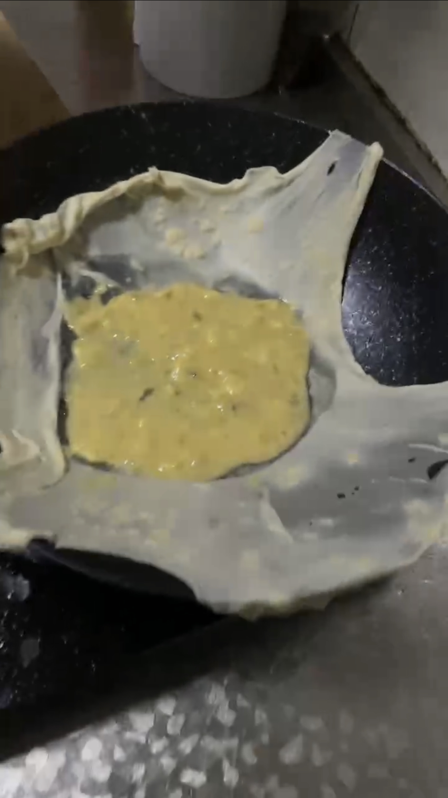
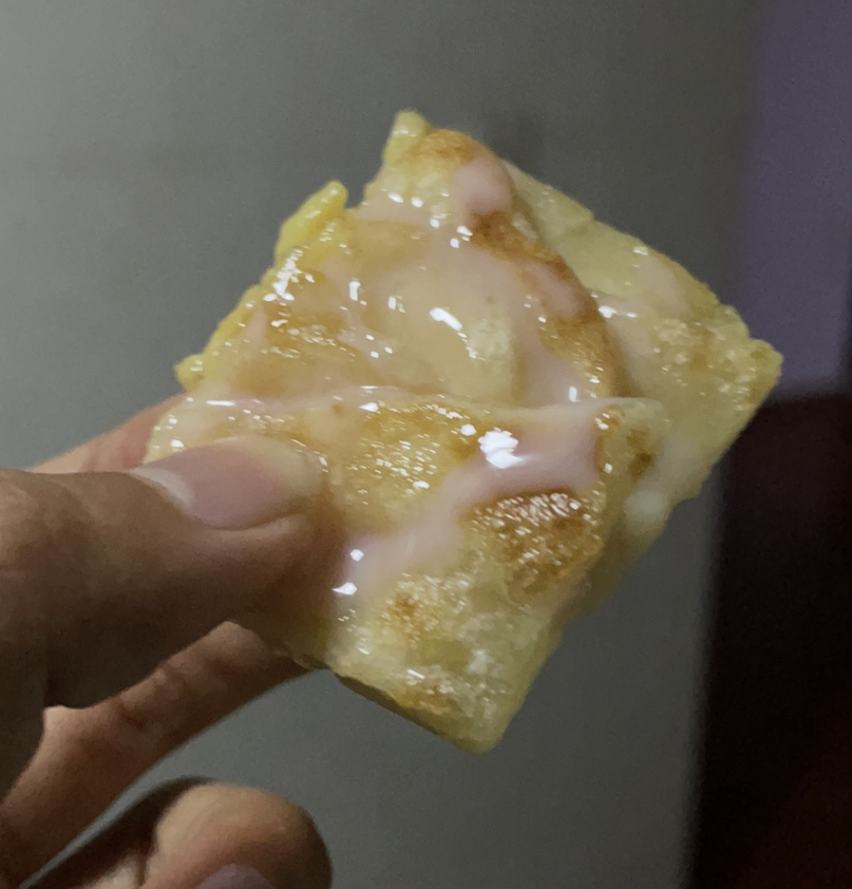

  如果不是这次在雨花毓秀门口吃到了甩手粑粑，我大概都已经忘记了这种美食了吧。

  小时候每次从卖甩手粑粑的小摊旁边走过，都会叫着大人买个吃吃，顺便在旁边看看是怎么甩出来的，在我看来，香蕉鸡蛋味是最好的，因为这种口味的是直接用新鲜的香蕉和鸡蛋在一起搅拌，而不是像其他的口味，用果酱去代替。

  小时候应该也就6、7块钱一个吧，现在涨价到12元一份。回来的路上我也盘算了一下，其实这个小吃的成本是很低的，制作的材料其实就只有一个鸡蛋、一个香蕉、一个面团、和一锅反复炸的油就行，鸡蛋大概0.5元一个，香蕉5元钱一公斤。看着简单但是其实做起来感觉还是挺难的，毕竟我不会甩。

  但是我还是决定自己去试一试，先得揉面，我一直以为那种小面团是可以买到的，最后没想到是要自己去制作。教学视频我参考了bilibili的绵羊料理，之前在热门视频里经常看见她，视频质量确实挺高的。从中我也知道了做这个面团要用中筋面粉，最好的话可以再加一点点高筋面粉增加一下面的伸展性。

  面团柔好之后要醒4个小时，虽然我也不知道为什么要醒（:dog:)

这个就是揉好的面团了

  最让人兴奋的应该是甩的时候，左手朝上，右手朝下，做一个扇形？然后转一圈换一个位置继续甩。我感觉面团之所以会被甩开，功劳全部在甩的后半截，得稍微那么用点力气，才能成功。初始状态下的面团最好甩，一旦失败从新揉重新开始就没那么好甩了。

炸的时候感觉火候不太好控制

  最终做出来的效果，其实还行吧

味道真的是很还原街上的口味了，唯一差点的估计就是炸的没外面的那么酥脆，原因要么就是炸的问题，要么就是甩的问题，有机会在继续研究一下
