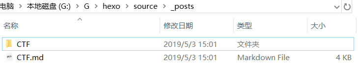

---

**博客搭建好了，测试一下功能是否正常**:hourglass:

<!--more-->


## 图片插入测试：



## 西瓜视频测试：

<iframe width="720" height="405" frameborder="0" src="https://www.ixigua.com/iframe/6890335223293477390?autoplay=0" referrerpolicy="unsafe-url" allowfullscreen></iframe>


## 哔哩哔哩视频测试：

<iframe src="//player.bilibili.com/player.html?aid=544680229&bvid=BV1zi4y1K7rp&cid=310810303&page=1" scrolling="no" border="0" frameborder="no" framespacing="0" allowfullscreen="true" width="720" height="405"> </iframe>


## 网易云音乐测试：

<iframe frameborder="no" border="0" marginwidth="0" marginheight="0" width=330 height=86 src="//music.163.com/outchain/player?type=2&id=520459812&auto=1&height=66"></iframe>


## Markdown测试

### 有序列表：

方法：（数字. +回车）

1. 有序列表one
2. 有序列表two
3. 有序列表three


### 无序列表：

方法：（- +空格）

例如：

- 第一个
  - (按住tab键可以向里面缩进)
    - 第三个缩进
      - 第四个缩进
- 第二个
- 第三个


### 高亮：

== （） ==需要高亮的部分夹在两个等号中间


### 上标和下标：

1. 下标： 夹在~~两个小波浪线中间 例如： H~2~O
2. 上标:  夹在~~两个小波浪线中间 例如:  X^5^


### 区块和代码块：

1. 区块(大于号+空格)  

> 按回车下一行会继续添加区块

2. 代码块（```）

```java
public static void main(String[] args){
    System.out.println("hello world")
}
```


### 表格：

方法：几个 ||||就可以出来

| 姓名   | 性别 | 身高  | 体重 |
| :----- | ---- | ----- | ---- |
| 杨建兴 | 男   | 175cm | 50kg |

### 变色：

方法：用检查元素，使用HTML改变

>我要变成蓝色


