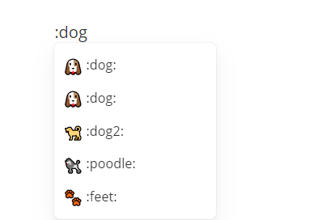

---

**最简洁的编辑器** :smirk:

<!--more-->

### 加粗

---

**Ctrl+B**


### 下划线

----

<u>Ctrl+U</u>


### 斜体

---

*Ctrl+I*


### 分割线

---

先输入三个及三个以上减号，敲回车


### 代码块

---

```java
System.out.println("怎么输入代码块？");
System.out.println("先输入``` 然后敲回车");
```


### 表情的使用

----

输入冒号:  后面就会有提示了




### 无序列表

----

输入一个- 然后空格后敲回车

- 
- 
  - 按下Tab向里缩进


### 有序列表

---

输入数字. 然后空格后敲回车

1. 俄罗斯
   1. 莫斯科
2. 美国
   1. 华盛顿
   2. 纽约
   3. 芝加哥
3. 中国
   1. 北京
   2. 上海
   3. 深圳


Ctrl+K 插入超链接


### [Typora常用好看主题推荐!!!](https://blog.csdn.net/weixin_52023681/article/details/120251523)
